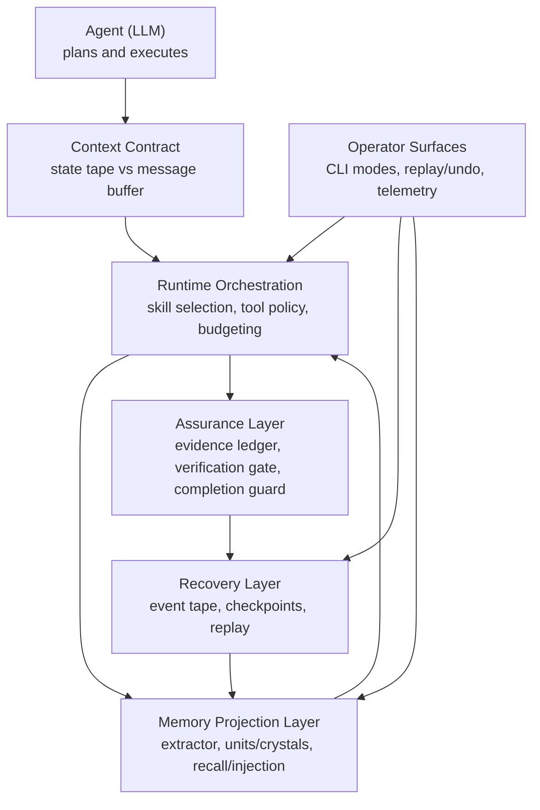

# Brewva

**A runtime that lets coding agents govern their own memory, context window, and execution quality — instead of having the framework do it behind their back.**

Most agent frameworks silently manage compaction, memory injection, and state persistence on behalf of the LLM. The agent never knows when its context was compressed, what was lost, or why a session resumed with stale state. This opacity makes agent behavior unpredictable and undebuggable.

Brewva takes the opposite approach: **make the agent the owner**.

## Core Design Principles

### 1. Agent Autonomy — The Agent Manages Itself

The runtime exposes two orthogonal pressure pipelines and hands the controls directly to the agent:

| Pipeline           | Resource                                                     | Pressure Signal    | Agent Action                                      |
| ------------------ | ------------------------------------------------------------ | ------------------ | ------------------------------------------------- |
| **State Tape**     | Append-only operational state (task/truth/verification/cost) | `tape_pressure`    | `tape_handoff` — mark a semantic phase boundary   |
| **Message Buffer** | LLM context window (user/assistant/tool messages)            | `context_pressure` | `session_compact` — compress conversation history |

In the extension-enabled profile, the runtime injects a **Context Contract** with explicit if-then rules for pressure handling, but never silently compacts on the agent's behalf. Memory injection is explicit and traceable (`[WorkingMemory]` / `[MemoryRecall]`), backed by persisted artifacts and events rather than opaque snapshots.

```
┌─────────────────────────────────────────────────────────────────┐
│                        Agent (LLM)                            │
│                                                               │
│  State mgmt:    tape_handoff / tape_info / tape_search        │
│  Message mgmt:  session_compact                               │
│                                                               │
│  The agent decides when to switch phases and when to compact  │
├─────────────────────────────────────────────────────────────────┤
│                Context Contract + TapeStatus                  │
│  Two independent signals:                                     │
│  • tape_pressure:    entries since last anchor                │
│  • context_pressure: actual token usage in message buffer     │
│  Explicit rules: which pressure triggers which action         │
├─────────────────────────────────────────────────────────────────┤
│              TurnReplayEngine (per-turn replay)               │
│   read tape → replay(checkpoint + delta) → TurnStateView      │
├─────────────────────────────────────────────────────────────────┤
│               Session Tape Store (append-only)                │
│                 event / anchor / checkpoint                   │
└─────────────────────────────────────────────────────────────────┘
```

### 2. Tape-First Recovery — State Lives in the Event Stream

Runtime state is never cached in opaque blobs. The **append-only event tape** (JSONL) is the single source of truth:

- **Every turn**: the `TurnReplayEngine` reads the tape, folds from the nearest checkpoint, and produces a `TurnStateView` — the complete reconstructed state for task, truth, cost, verification, and parallel execution.
- **After `kill -9`**: the next startup replays the same tape and arrives at the identical state. No snapshot files, no in-memory maps, no dual-source ambiguity.
- **Checkpoints**: the runtime periodically writes machine-generated checkpoints to accelerate replay. **Anchors** are semantic phase markers created by the agent via `tape_handoff`.

This means every session is fully auditable, every state transition is replayable, and recovery is deterministic.

### 3. Contract-Driven Execution — Every Step Has Constraints

Execution flows through explicit gates at every layer:

- **Skill Contracts** define tool permissions, budget limits, and required outputs. Higher-tier skills (project) cannot relax lower-tier constraints (base).
- **Verification Gates** (`quick` / `standard` / `strict`) block completion until required evidence is recorded in the ledger.
- **Fail-Closed Gate** halts execution when `context_pressure` reaches critical and the agent has not called `session_compact` — based on actual token counts from the SessionManager, not heuristic estimates.
- **Evidence Ledger** captures every tool outcome as an append-only evidence chain. Missing evidence blocks completion — no silent pass-throughs.
- **Budget Boundaries** enforce limits on context injection size, session cost, and parallel concurrency.

### 4. Projection-Based Memory — Derived, Traceable, Reviewable

Memory is implemented as an event-driven projection layer on top of the tape:

- **Trace source**: `.orchestrator/events/<session>.jsonl` is the immutable source; memory never mutates tape rows.
- **Derived projections**: `Unit`, `Crystal`, `Insight`, and `EVOLVES` edges are stored in `.orchestrator/memory/*.jsonl`.
- **Context surfaces**: in the extension-enabled profile, each `before_agent_start` can inject `[WorkingMemory]` (`brewva.working-memory`) and `[MemoryRecall]` (`brewva.memory-recall`) with budget-aware truncation/drop behavior.
- **Reviewable evolution**: proposed EVOLVES relations stay shadow-only until explicit review (`memory_review_evolves_edge`), after which side effects (such as unit superseding) are auditable via memory events.

## Architecture

README uses a conceptual architecture view (high-level intent and control model):



Implementation-level architecture (package DAG, execution profiles, hook wiring)
is documented in:

- `docs/architecture/system-architecture.md`
- `docs/architecture/control-and-data-flow.md`
- `docs/journeys/memory-projection-and-recall.md`

## Packages

| Package                            | Responsibility                                                                                                                        |
| ---------------------------------- | ------------------------------------------------------------------------------------------------------------------------------------- |
| `@brewva/brewva-runtime`           | Skill contracts, evidence ledger, verification gates, tape replay engine, memory projection/retrieval, context budget, cost tracking  |
| `@brewva/brewva-channels-telegram` | Telegram channel adapter package: update projection, approval callback signing, long-polling transport, and outbound rendering        |
| `@brewva/brewva-tools`             | Runtime-aware tools: LSP/AST adapters, ledger query, skill lifecycle, task management, tape operations, memory insight/evolves review |
| `@brewva/brewva-extensions`        | Event hook wiring: context injection, memory bridge hooks, quality gates, completion guards, event stream persistence                 |
| `@brewva/brewva-cli`               | CLI entrypoint, session bootstrap, TUI / `--print` / `--json` modes, replay and undo                                                  |

## Skill System

Skills are loaded in three tiers with increasing precedence — higher tiers can tighten but never relax lower-tier contracts:

| Tier    | Location          | Examples                                                                     |
| ------- | ----------------- | ---------------------------------------------------------------------------- |
| Base    | `skills/base/`    | `cartography`, `debugging`, `planning`, `verification`, `patching`, `review` |
| Pack    | `skills/packs/`   | `typescript`, `react`, `bun`, `skill-creator`, `browser`, `frontend-ui-ux`   |
| Project | `skills/project/` | `brewva-project`                                                             |

Discovery walks multiple roots (module ancestors, executable sidecar, global config, project config, explicit `skills.roots`) with symlink containment and depth bounds.

## Quick Start

```bash
bun install
bun run build
bun run start -- --help
```

### CLI Modes

```bash
# Interactive TUI
bun run start

# Interactive with initial prompt
bun run start -- "Fix failing tests in runtime"

# One-shot execution
bun run start -- --print "Refactor this function"

# JSON output (for programmatic consumption)
bun run start -- --json "Analyze this module"

# Replay a session timeline
bun run start -- --replay --session <session-id>

# Undo last patch set
bun run start -- --undo
```

## Binary Distribution

Platform-specific binaries are compiled with `bun build --compile` and published via the `@brewva/brewva` launcher package, which resolves the correct platform binary at install time.

```bash
bun run build:binaries
```

## Development

```bash
bun run typecheck          # Type-check all packages + scripts
bun run typecheck:test     # Type-check test suite
bun test                   # Run unit + integration tests
bun run test:docs          # Validate documentation quality
bun run test:dist          # Verify dist exports + CLI help banner
bun run build:binaries     # Compile platform binaries
```

## Documentation

| Section         | Path                    | Purpose                                                                 |
| --------------- | ----------------------- | ----------------------------------------------------------------------- |
| Guides          | `docs/guide/`           | Operational usage and system understanding                              |
| Architecture    | `docs/architecture/`    | System layers, control flow, invariants                                 |
| Journeys        | `docs/journeys/`        | End-to-end cross-module workflows                                       |
| Reference       | `docs/reference/`       | Contract-level definitions (config, tools, skills, events, runtime API) |
| Research        | `docs/research/`        | Roadmap priorities and design notes                                     |
| Troubleshooting | `docs/troubleshooting/` | Failure patterns and remediation                                        |

## License

[Apache](LICENSE)
