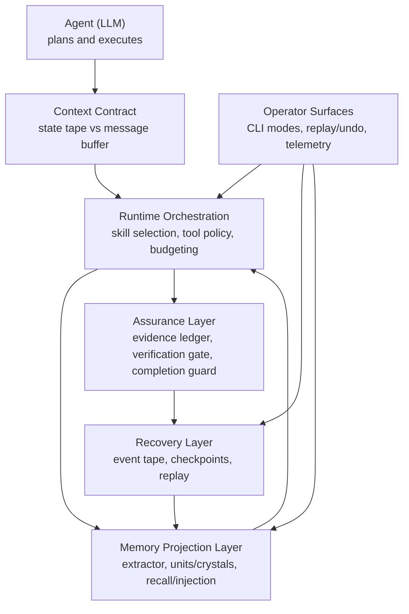

# Brewva

**A runtime for auditable agent governance of memory, context pressure, and execution quality.**

Most frameworks already manage compaction, memory injection, and state persistence. The core problem is not whether runtime does governance, but whether that governance is inspectable and replayable.

Brewva's stance: **runtime may govern, but governance must be explicit, evented, and recoverable**.

## Core Design Principles

### 1. Agent Autonomy — The Agent Manages Itself

The runtime exposes three orthogonal control loops and keeps authority with the agent:

| Pipeline                | Resource                                                       | Pressure Signal                          | Agent/Runtime Action                                                 |
| ----------------------- | -------------------------------------------------------------- | ---------------------------------------- | -------------------------------------------------------------------- |
| **State Tape**          | Append-only operational state (task/truth/verification/cost)   | `tape_pressure`                          | `tape_handoff` — mark semantic phase boundaries                      |
| **Message Buffer**      | LLM context window (user/assistant/tool messages)              | `context_pressure`                       | `session_compact` — compress conversation history                    |
| **Cognitive Inference** | Runtime cognition budget for semantic relation/ranking/lessons | cognitive budget status (calls + tokens) | Use `CognitivePort` or deterministically fall back when budget-tight |

In the extension-enabled profile, the runtime injects a **Context Contract** with explicit if-then rules for pressure handling, but never silently compacts on the agent's behalf. Memory/context injection is explicit and traceable through semantic sources (`brewva.identity`, `brewva.truth`, `brewva.task-state`, `brewva.tool-failures`, `brewva.memory`), backed by persisted artifacts and events rather than opaque snapshots.

For runtime cognition, Brewva uses a dual-path design (`CognitivePort` + deterministic fallback):

- `memory.cognitive.mode="off"`: no cognitive calls; deterministic behavior only.
- `memory.cognitive.mode="shadow"`: cognitive calls are executed and audited, but do not mutate runtime decisions.
- `memory.cognitive.mode="active"`: cognitive outputs may be applied (within budget), with deterministic fallback on exhaustion/error.

This preserves controllability without sacrificing deterministic recovery.

```
┌─────────────────────────────────────────────────────────────────┐
│                        Agent (LLM)                            │
│                                                               │
│  State mgmt:    tape_handoff / tape_info / tape_search        │
│  Message mgmt:  session_compact                               │
│                                                               │
│  The agent decides when to switch phases and when to compact  │
├─────────────────────────────────────────────────────────────────┤
│                Context Contract + TapeStatus                  │
│  Two independent signals:                                     │
│  • tape_pressure:    entries since last anchor                │
│  • context_pressure: actual token usage in message buffer     │
│  Explicit rules: which pressure triggers which action         │
├─────────────────────────────────────────────────────────────────┤
│              TurnReplayEngine (per-turn replay)               │
│   read tape → replay(checkpoint + delta) → TurnStateView      │
├─────────────────────────────────────────────────────────────────┤
│               Session Tape Store (append-only)                │
│                 event / anchor / checkpoint                   │
└─────────────────────────────────────────────────────────────────┘
```

### 2. Tape-First Recovery — State Lives in the Event Stream

Runtime state is never cached in opaque blobs. The **append-only event tape** (JSONL) is the authoritative state log:

- **Every turn**: `TurnReplayEngine` folds from tape checkpoints + deltas and reconstructs task/truth state deterministically.
- **Session hydration on startup**: runtime replays tape events to recover skill activation, tool-call counters, warning dedupe sets, ledger compaction cooldown, and cost-budget state.
- **Memory recovery**: when `.orchestrator/memory/*` artifacts are missing, memory projections can be rebuilt from tape (`memory_*` projection snapshots, with semantic extraction fallback).
- **Checkpoints**: machine-generated checkpoints accelerate replay. **Anchors** are semantic phase markers created by the agent via `tape_handoff`.

This keeps sessions auditable and replayable across restarts without relying on process-local runtime maps.

### 3. Contract-Driven Execution — Every Step Has Constraints

Execution flows through explicit gates at every layer:

- **Skill Contracts** define tool permissions, budget limits, and required outputs. Higher-tier skills (project) cannot relax lower-tier constraints (base).
- **Verification Gates** (`quick` / `standard` / `strict`) block completion until required evidence is recorded in the ledger.
- **Fail-Closed Gate** halts execution when `context_pressure` reaches critical and the agent has not called `session_compact` — based on actual token counts from the SessionManager, not heuristic estimates.
- **Evidence Ledger** captures every tool outcome as an append-only evidence chain. Missing evidence blocks completion — no silent pass-throughs.
- **Budget Boundaries** enforce limits on context injection size, session cost, and parallel concurrency.

### 4. Projection-Based Memory — Derived, Traceable, Reviewable

Memory is implemented as an event-driven projection layer on top of the tape:

- **Trace source**: `.orchestrator/events/<session>.jsonl` is immutable; memory never mutates tape rows.
- **Replayable projections**: `memory_*` events persist projection snapshots so memory can be rebuilt from tape when projection files are missing.
- **Layered memory tiers**: session-local memory is augmented by a global tier (`.orchestrator/memory/global`) with deterministic promotion, decay, pruning, and pass-resolution.
- **Derived projections**: `Unit`, `Crystal`, `Insight`, and `EVOLVES` edges are stored in `.orchestrator/memory/*.jsonl`; cross-session pattern aggregation is compiled into global crystals.
- **Context surfaces**: in the extension-enabled profile, each `before_agent_start` can inject semantic context sources (`brewva.identity`, `brewva.truth`, `brewva.task-state`, `brewva.tool-failures`, `brewva.memory`) with budget-aware truncation/drop behavior.
- **Feedback loop from outcomes**: verification outcomes and cognitive reflections (`verification_outcome_recorded`, `cognitive_outcome_reflection`) are extracted into learning units and fed back into subsequent recall.
- **Reviewable evolution**: proposed EVOLVES relations stay shadow-only until explicit review (`memory_review_evolves_edge`), after which side effects (such as unit superseding) are auditable via memory events.

Every cognitive inference is evented (`cognitive_*`) and remains replayable/auditable under the same tape-first invariants.

Event visibility is stratified by `infrastructure.events.level`:

- `audit`: replay/audit-critical stream
- `ops` (default): audit + operational transitions/warnings
- `debug`: full diagnostics (`viewport_*`, `cognitive_*`, parallel scan detail)

## Architecture

README uses a conceptual architecture view (high-level intent and control model):



Implementation-level architecture (package DAG, execution profiles, hook wiring)
is documented in:

- `docs/architecture/system-architecture.md`
- `docs/architecture/control-and-data-flow.md`
- `docs/journeys/memory-projection-and-recall.md`

## Packages

| Package                            | Responsibility                                                                                                                                                                                 |
| ---------------------------------- | ---------------------------------------------------------------------------------------------------------------------------------------------------------------------------------------------- |
| `@brewva/brewva-runtime`           | Skill contracts, evidence ledger, verification gates, tape replay engine, memory projection/retrieval, context budget, cost tracking (`@brewva/brewva-runtime/channels` for channel contracts) |
| `@brewva/brewva-channels-telegram` | Telegram channel adapter package: update projection, approval callback signing, long-polling transport, and outbound rendering                                                                 |
| `@brewva/brewva-gateway`           | Local control-plane daemon: typed WebSocket API, session process supervision, heartbeat policy reload, and lifecycle CLI                                                                       |
| `@brewva/brewva-tools`             | Runtime-aware tools: LSP/AST adapters, ledger query, skill lifecycle, task management, tape operations, memory insight/evolves review                                                          |
| `@brewva/brewva-extensions`        | Event hook wiring: context injection, memory bridge hooks, quality gates, completion guards, event stream persistence                                                                          |
| `@brewva/brewva-cli`               | CLI entrypoint, session bootstrap, TUI / `--print` / `--json` modes, replay and undo                                                                                                           |

## Skill System

Skills are loaded in three tiers with increasing precedence — higher tiers can tighten but never relax lower-tier contracts:

| Tier    | Location          | Current Skills                                                                                                |
| ------- | ----------------- | ------------------------------------------------------------------------------------------------------------- |
| Base    | `skills/base/`    | `cartography`, `compose`, `debugging`, `exploration`, `git`, `patching`, `planning`, `review`, `verification` |
| Pack    | `skills/packs/`   | `browser`, `frontend-ui-ux`, `gh-issues`, `github`, `skill-creator`                                           |
| Project | `skills/project/` | `brewva-project`                                                                                              |

Discovery walks multiple roots (module ancestors, executable sidecar, global config, project config, explicit `skills.roots`) with symlink containment and depth bounds.

## Quick Start

```bash
bun install
bun run build
bun run start -- --help
```

### CLI Modes

```bash
# Interactive TUI
bun run start

# Interactive with initial prompt
bun run start -- "Fix failing tests in runtime"

# One-shot execution
bun run start -- --print "Refactor this function"

# JSON output (for programmatic consumption)
bun run start -- --json "Analyze this module"

# Replay a session timeline
bun run start -- --replay --session <session-id>

# Undo last patch set
bun run start -- --undo

# Start local control-plane daemon (repo-local entrypoint)
bun run start -- gateway start --detach

# If brewva is installed globally, this also works
brewva gateway start --detach

# Install as always-on OS service (recommended for production/devbox)
brewva onboard --install-daemon

# Linux explicit mode
brewva onboard --install-daemon --systemd

# Optional loopback HTTP liveness probe (for supervisor checks)
brewva onboard --install-daemon --health-http-port 43112 --health-http-path /healthz
```

## Binary Distribution

Platform-specific binaries are compiled with `bun build --compile` and published via the `@brewva/brewva` launcher package, which resolves the correct platform binary at install time.

```bash
bun run build:binaries
```

## Development

```bash
bun run typecheck          # Type-check all packages + scripts
bun run typecheck:test     # Type-check test suite
bun test                   # Run unit + integration tests
bun run test:docs          # Validate documentation quality
bun run test:dist          # Verify dist exports + CLI help banner
bun run build:binaries     # Compile platform binaries
```

## Documentation

| Section         | Path                    | Purpose                                                                 |
| --------------- | ----------------------- | ----------------------------------------------------------------------- |
| Guides          | `docs/guide/`           | Operational usage and system understanding                              |
| Architecture    | `docs/architecture/`    | System layers, control flow, invariants                                 |
| Journeys        | `docs/journeys/`        | End-to-end cross-module workflows                                       |
| Reference       | `docs/reference/`       | Contract-level definitions (config, tools, skills, events, runtime API) |
| Research        | `docs/research/`        | Roadmap priorities and design notes                                     |
| Troubleshooting | `docs/troubleshooting/` | Failure patterns and remediation                                        |

## License

[Apache](LICENSE)
