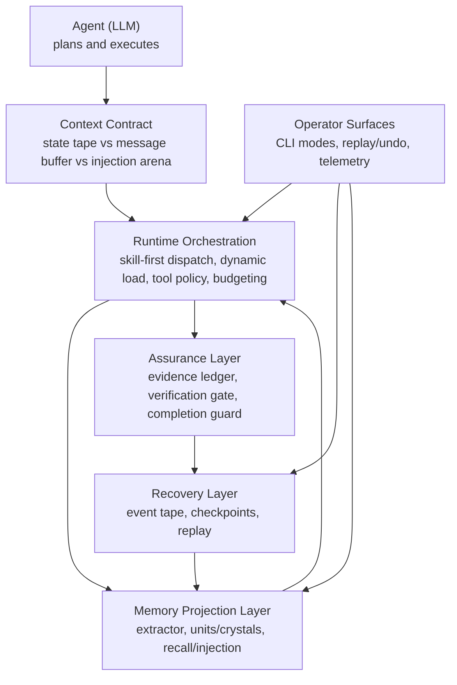

# Brewva

<p align="center">
  <a href="https://github.com/arcthur/brewva/actions/workflows/ci.yml?branch=main"></a>
  <a href="https://github.com/arcthur/brewva/releases"></a>
  <a href="LICENSE"></a>
</p>

Brewva is a runtime for AI coding agents that makes governance explicit, evented, and recoverable — every decision is recorded in an append-only tape that serves as both audit trail and recovery source.

**Runtime may govern, but governance must be inspectable and replayable.**

## Core Design Principles

Principles are split by permanence. Durable principles serve system integrity
and do not simplify as models improve. Adaptive principles compensate for
current model limitations and are designed to progressively retire.

### Durable

1. **Tape-first recovery** — session state is reconstructed from append-only events, checkpoints, and replay; no opaque process-local snapshots.
2. **Contract-driven execution** — skill policy, verification gates, evidence ledger, and budget limits are explicit runtime constraints.
3. **Skill-first orchestration** — prompt text is a dispatch signal; executable skill contracts are activated on demand (`skill_load`) with replayable lifecycle events.
4. **Projection-based memory** — memory structures are derived from tape events and can be rebuilt deterministically.
5. **Workspace-first orchestration** — multi-agent and channel state is isolated in workspace-scoped storage for restart-safe operation.

### Governing meta-principle

6. **Mechanism metabolism** — every optimization mechanism carries its own exit condition. A mechanism that cannot demonstrate measurable benefit degrades to a no-op or is retired, without affecting correctness. Context management complexity tends to self-reproduce; this principle prevents the optimization layer from becoming a permanent dependency.

### Capability-adaptive

7. **Pressure transparency** — runtime exposes resource pressure (`tape_pressure`, `context_pressure`) as explicit contract text; the agent decides how to respond.
8. **Adaptive context strategy** — context injection is governed by a strategy arm (`managed` → `hybrid` → `passthrough`) selected per session based on model capability and context window size. Transitional mechanisms (zone budgets, adaptive controller, stability monitor) each carry retirement policies and can be independently disabled by observed 7-day effectiveness metrics.

## Architecture

Conceptual architecture view (high-level intent and control model):



Implementation-level architecture (package DAG, execution profiles, hook wiring):
`docs/architecture/system-architecture.md` · `docs/architecture/control-and-data-flow.md` · `docs/journeys/memory-projection-and-recall.md`

Primary package surfaces:

- `@brewva/brewva-runtime`: runtime contracts, tape replay, memory, verification, cost.
- `@brewva/brewva-tools`: runtime-aware tools (ledger/task/tape/skill/memory flows).
- `@brewva/brewva-extensions`: lifecycle hook wiring and runtime integration guards.
- `@brewva/brewva-cli`: user entrypoint and session bootstrap (`interactive` / `--print` / `--json` / replay/undo).
- `@brewva/brewva-gateway`: local control-plane daemon and worker supervision.
- `@brewva/brewva-channels-telegram`: Telegram channel adapter and transport.
- `@brewva/brewva-ingress`: webhook worker/server ingress for Telegram edge delivery.

Skill tiers (higher tiers can tighten but never relax lower-tier contracts):

- Base (`skills/base/`): `brainstorming`, `cartography`, `compose`, `debugging`, `execution`, `exploration`, `finishing`, `git`, `patching`, `planning`, `review`, `tdd`, `verification`
- Pack (`skills/packs/`): `agent-browser`, `frontend-design`, `gh-issues`, `github`, `skill-creator`, `telegram-interactive-components`
- Project (`skills/project/`): `brewva-project`, `brewva-self-improve`, `brewva-session-logs`

## Quick Start

Choose one entry path:

### 1) Repository Mode (Contributor)

```bash
bun install
bun run build
bun run start -- --help
bun run start
```

### 2) Installed CLI Mode (Local Command)

```bash
bun run install:local
brewva --help
brewva "Summarize recent runtime changes"
```

For complete CLI modes and gateway/onboard operations:

- `docs/guide/cli.md`
- `docs/guide/installation.md`
- `docs/guide/gateway-control-plane-daemon.md`

## Development

```bash
bun run check              # Full quality gate (format + lint + typecheck + typecheck:test)
bun test                   # Run unit + integration tests
bun run test:docs          # Validate documentation quality
```

For distribution/release verification:

```bash
bun run test:dist          # Verify dist exports + CLI help banner
bun run build:binaries     # Compile platform binaries
```

## Documentation

| Section         | Path                    | Purpose                                                                 |
| --------------- | ----------------------- | ----------------------------------------------------------------------- |
| Guides          | `docs/guide/`           | Operational usage and system understanding                              |
| Architecture    | `docs/architecture/`    | System layers, control flow, invariants                                 |
| Journeys        | `docs/journeys/`        | End-to-end cross-module workflows                                       |
| Reference       | `docs/reference/`       | Contract-level definitions (config, tools, skills, events, runtime API) |
| Research        | `docs/research/`        | Incubating roadmap notes and design hypotheses with promotion targets   |
| Troubleshooting | `docs/troubleshooting/` | Failure patterns and remediation                                        |

## Inspired by

- [Amp](https://ampcode.com/)
- [bub](https://bub.build/)
- [openclaw](https://openclaw.ai/)

## License

[Apache](LICENSE)
