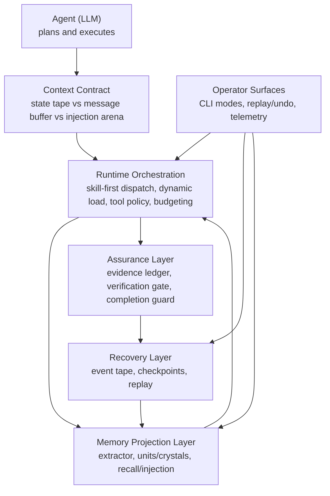

# Brewva

<p align="center">
  <a href="https://github.com/arcthur/brewva/actions/workflows/ci.yml?branch=main"></a>
  <a href="https://github.com/arcthur/brewva/releases"></a>
  <a href="LICENSE"></a>
</p>

Brewva is a runtime for AI coding agents that makes governance explicit, evented, and recoverable — every decision is recorded in an append-only tape that serves as both audit trail and recovery source.

**Runtime may govern, but governance must be inspectable and replayable.**

## Core Design Principles

Brewva follows six architecture drivers:

1. **Agent autonomy with explicit pressure contracts**
   - Runtime emits pressure signals (`tape_pressure`, `context_pressure`) and context contracts.
   - Agent remains responsible for control actions (`tape_handoff`, `session_compact`).
   - Context injection is managed as an append-only arena with allocator-first planning (`ZoneBudgetAllocator`) plus adaptive control (`ZoneBudgetController`).
   - Arena memory has explicit SLO boundaries (`maxEntriesPerSession`) with deterministic degradation policy.
   - External retrieval is treated as an explicit I/O boundary (`brewva.rag-external`) instead of a parallel prompt path.
2. **Skill-first orchestration with dynamic loading**
   - Prompt text is treated as a dispatch signal, not the primary execution structure.
   - Executable skill contracts are activated on demand (`skill_load`) instead of eager capability preload.
   - Skill lifecycle events (`skill_activated`, `skill_completed`) keep orchestration replayable and auditable.
3. **Tape-first recovery**
   - Session state is reconstructed from append-only events, checkpoints, and replay.
   - Recovery avoids opaque process-local snapshots.
4. **Contract-driven execution**
   - Skill policy, verification gates, evidence ledger, and budget limits are explicit runtime constraints.
5. **Projection-based memory**
   - Memory structures are derived from tape events and can be rebuilt deterministically.
   - Runtime injects split memory sources (`brewva.memory-working`, `brewva.memory-recall`) with pressure-aware recall fallback.
6. **Workspace-first orchestration**
   - Multi-agent and channel state is isolated and persisted in workspace-scoped storage for restart-safe operation.

## Architecture

Conceptual architecture view (high-level intent and control model):



Implementation-level architecture (package DAG, execution profiles, hook wiring):
`docs/architecture/system-architecture.md` · `docs/architecture/control-and-data-flow.md` · `docs/journeys/memory-projection-and-recall.md`

Primary package surfaces:

- `@brewva/brewva-runtime`: runtime contracts, tape replay, memory, verification, cost.
- `@brewva/brewva-tools`: runtime-aware tools (ledger/task/tape/skill/memory flows).
- `@brewva/brewva-extensions`: lifecycle hook wiring and runtime integration guards.
- `@brewva/brewva-cli`: user entrypoint and session bootstrap (`interactive` / `--print` / `--json` / replay/undo).
- `@brewva/brewva-gateway`: local control-plane daemon and worker supervision.
- `@brewva/brewva-channels-telegram`: Telegram channel adapter and transport.
- `@brewva/brewva-ingress`: webhook worker/server ingress for Telegram edge delivery.

Skill tiers (higher tiers can tighten but never relax lower-tier contracts):

- Base (`skills/base/`): `brainstorming`, `cartography`, `compose`, `debugging`, `execution`, `exploration`, `finishing`, `git`, `patching`, `planning`, `review`, `tdd`, `verification`
- Pack (`skills/packs/`): `agent-browser`, `frontend-design`, `gh-issues`, `github`, `skill-creator`, `telegram-interactive-components`
- Project (`skills/project/`): `brewva-project`, `brewva-self-improve`, `brewva-session-logs`

## Quick Start

Choose one entry path:

### 1) Repository Mode (Contributor)

```bash
bun install
bun run build
bun run start -- --help
bun run start
```

### 2) Installed CLI Mode (Local Command)

```bash
bun run install:local
brewva --help
brewva "Summarize recent runtime changes"
```

For complete CLI modes and gateway/onboard operations:

- `docs/guide/cli.md`
- `docs/guide/installation.md`
- `docs/guide/gateway-control-plane-daemon.md`

## Development

```bash
bun run check              # Full quality gate (format + lint + typecheck + typecheck:test)
bun test                   # Run unit + integration tests
bun run test:docs          # Validate documentation quality
```

For distribution/release verification:

```bash
bun run test:dist          # Verify dist exports + CLI help banner
bun run build:binaries     # Compile platform binaries
```

## Documentation

| Section         | Path                    | Purpose                                                                 |
| --------------- | ----------------------- | ----------------------------------------------------------------------- |
| Guides          | `docs/guide/`           | Operational usage and system understanding                              |
| Architecture    | `docs/architecture/`    | System layers, control flow, invariants                                 |
| Journeys        | `docs/journeys/`        | End-to-end cross-module workflows                                       |
| Reference       | `docs/reference/`       | Contract-level definitions (config, tools, skills, events, runtime API) |
| Research        | `docs/research/`        | Incubating roadmap notes and design hypotheses with promotion targets   |
| Troubleshooting | `docs/troubleshooting/` | Failure patterns and remediation                                        |

## Inspired by

- [Amp](https://ampcode.com/)
- [bub](https://bub.build/)
- [openclaw](https://openclaw.ai/)

## License

[Apache](LICENSE)
