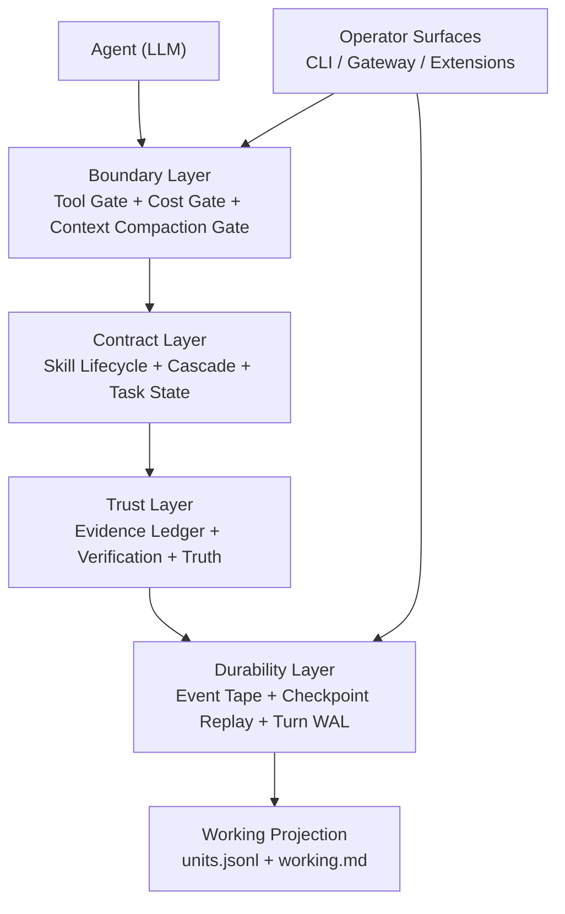

# Brewva

<p align="center">
  <a href="https://github.com/arcthur/brewva/actions/workflows/ci.yml?branch=main"></a>
  <a href="https://github.com/arcthur/brewva/releases"></a>
  <a href="LICENSE"></a>
</p>

Brewva is a runtime for AI coding agents that makes governance explicit, evented, and recoverable — every decision is recorded in an append-only tape that serves as both audit trail and recovery source.

**Runtime may govern, but governance must be inspectable and replayable.**

## Core Position

**Brewva does not try to make the agent smarter. Brewva makes agent behavior trustworthy.**

The runtime is optimized for one question:

`Why can we trust this agent action?`

Design principles:

1. **Single-path explainability** — context injection, tool gating, compaction, and budget decisions follow deterministic runtime paths.
2. **Tape-first replayability** — event tape + checkpoint replay is the recovery source of truth; behavior is reconstructable after failure.
3. **Bounded autonomy** — context, tools, cost, and parallelism all have explicit limits and fail-closed behavior under pressure.
4. **Evidence-first contracts** — verification, ledger, task/truth updates, and skill lifecycle are explicit contract boundaries.
5. **Working projection only** — projection state is a deterministic fold from tape (`units` + `working.md`), not adaptive cognition.
6. **Governance hooks, not cognition loops** — optional governance checks (`verifySpec`, cost anomaly, compaction integrity) enrich auditability without changing core decision semantics.

## Architecture

Conceptual architecture view (high-level intent and control model):


```mermaid
flowchart TD
  AGENT["Agent (LLM)"]
  TRUST["Trust Layer<br/>Evidence Ledger + Verification + Truth"]
  BOUNDARY["Boundary Layer<br/>Tool Gate + Cost Gate + Context Compaction Gate"]
  CONTRACT["Contract Layer<br/>Skill Lifecycle + Cascade + Task State"]
  DURABILITY["Durability Layer<br/>Event Tape + Checkpoint Replay + Turn WAL"]
  PROJECTION["Working Projection<br/>units.jsonl + working.md"]
  UX["Operator Surfaces<br/>CLI / Gateway / Extensions"]

  AGENT --> BOUNDARY
  BOUNDARY --> CONTRACT
  CONTRACT --> TRUST
  TRUST --> DURABILITY
  DURABILITY --> PROJECTION
  UX --> BOUNDARY
  UX --> DURABILITY
```

Implementation-level architecture (package DAG, execution profiles, hook wiring):
`docs/architecture/system-architecture.md` · `docs/architecture/control-and-data-flow.md` · `docs/journeys/working-projection.md`

Primary package surfaces:

- `@brewva/brewva-runtime`: governance runtime contracts, tape replay, verification, working projection, cost.
- `@brewva/brewva-tools`: runtime-aware tools (ledger/task/tape/skill/cost/governance flows).
- `@brewva/brewva-extensions`: lifecycle hook wiring and runtime integration guards.
- `@brewva/brewva-cli`: user entrypoint and session bootstrap (`interactive` / `--print` / `--json` / replay/undo).
- `@brewva/brewva-gateway`: local control-plane daemon and worker supervision.
- `@brewva/brewva-channels-telegram`: Telegram channel adapter and transport.
- `@brewva/brewva-ingress`: webhook worker/server ingress for Telegram edge delivery.

Skill tiers (higher tiers can tighten but never relax lower-tier contracts):

- Base (`skills/base/`): `brainstorming`, `cartography`, `compose`, `debugging`, `execution`, `exploration`, `finishing`, `git`, `patching`, `planning`, `recovery`, `review`, `tdd`, `verification`
- Pack (`skills/packs/`): `agent-browser`, `frontend-design`, `goal-loop`, `gh-issues`, `github`, `skill-creator`, `telegram-channel-behavior`, `telegram-interactive-components`
- Project (`skills/project/`): `brewva-project`, `brewva-self-improve`, `brewva-session-logs`

## Quick Start

Choose one entry path:

### 1) Repository Mode (Contributor)

```bash
bun install
bun run build
bun run start -- --help
bun run start
```

### 2) Installed CLI Mode (Local Command)

```bash
bun run install:local
brewva --help
brewva "Summarize recent runtime changes"
```

For complete CLI modes and gateway/onboard operations:

- `docs/guide/cli.md`
- `docs/guide/installation.md`
- `docs/guide/gateway-control-plane-daemon.md`

## Runtime Defaults Snapshot

- Execution routing defaults to `security.execution.backend=best_available` with
  `security.execution.fallbackToHost=false`.
- Read-only verification is explicitly reported as `skipped` (not `pass`).
- Skill routing defaults to deterministic governance-first selection
  (`skills.selector.mode=deterministic`); translation stays skipped and semantic telemetry reflects runtime routing outcome.
- Cascade missing consumes is deterministic pause (`reason=missing_consumes`);
  runtime no longer auto-replans dependency chains.
- `compose` is planning-only and now has a higher read budget (`max_tool_calls: 120`).

## Development

```bash
bun run check              # Full quality gate (format + lint + typecheck + typecheck:test)
bun test                   # Run unit + integration tests
bun run test:docs          # Validate documentation quality
bun run analyze:projection  # Project working-projection quality from tape events (offline)
```

For distribution/release verification:

```bash
bun run test:dist          # Verify dist exports + CLI help banner
bun run build:binaries     # Compile platform binaries
```

## Documentation

| Section         | Path                    | Purpose                                                                 |
| --------------- | ----------------------- | ----------------------------------------------------------------------- |
| Guides          | `docs/guide/`           | Operational usage and system understanding                              |
| Architecture    | `docs/architecture/`    | System layers, control flow, invariants                                 |
| Journeys        | `docs/journeys/`        | End-to-end cross-module workflows                                       |
| Reference       | `docs/reference/`       | Contract-level definitions (config, tools, skills, events, runtime API) |
| Research        | `docs/research/`        | Incubating roadmap notes and design hypotheses with promotion targets   |
| Troubleshooting | `docs/troubleshooting/` | Failure patterns and remediation                                        |

## Inspired by

- [Amp](https://ampcode.com/)
- [bub](https://bub.build/)
- [openclaw](https://openclaw.ai/)

## License

[Apache](LICENSE)
