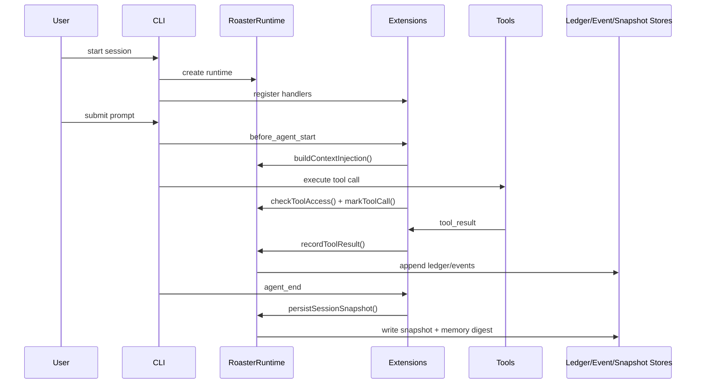
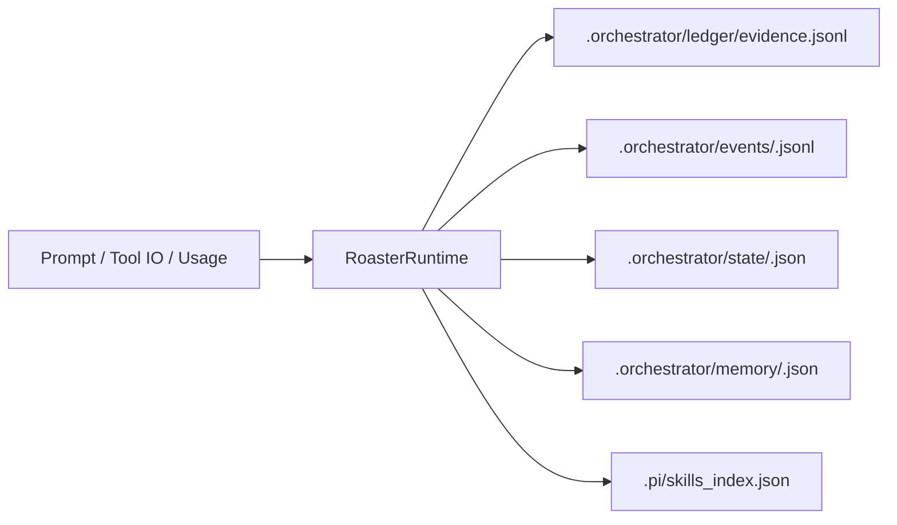
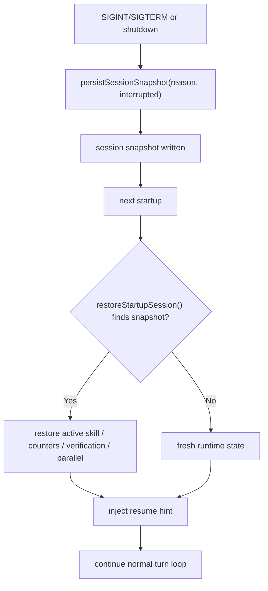
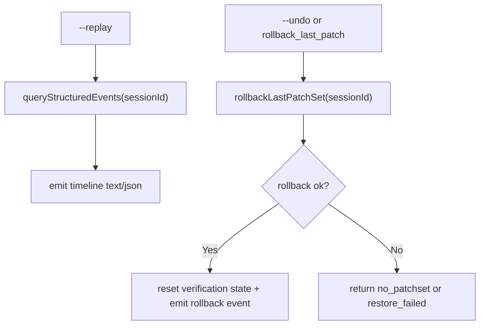

# Control And Data Flow

This document models runtime control flow and persistence flow for normal execution, interruption, replay, and rollback.

## Normal Execution (Control Flow)

## Persistence Data Flow

## Interruption and Resume Flow

## Replay and Rollback Flow

