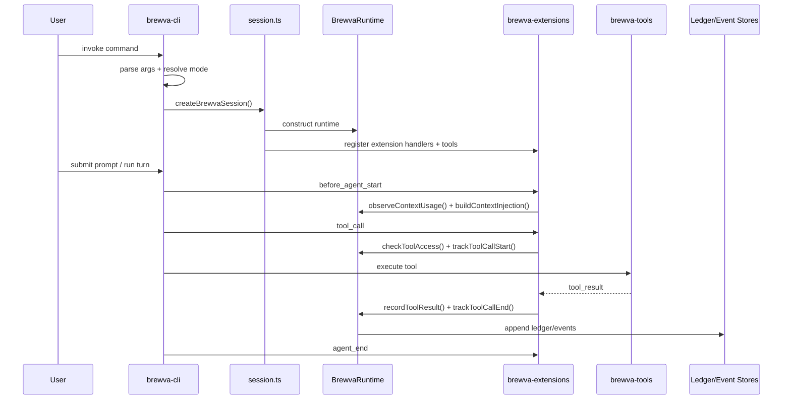
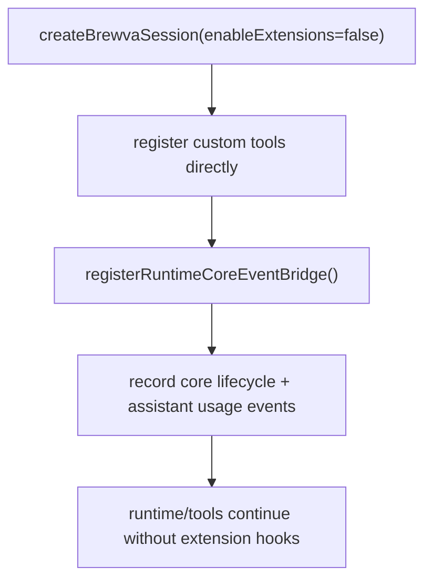
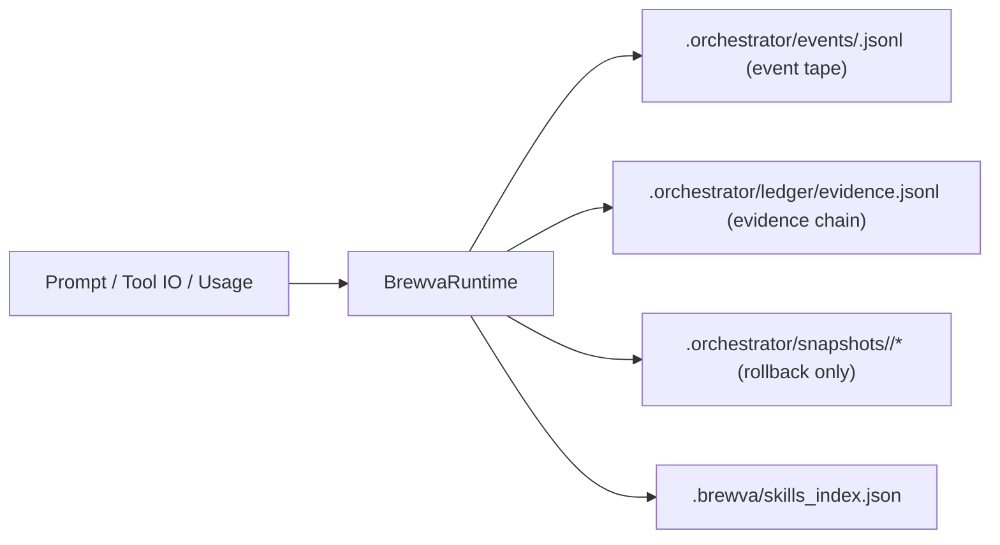
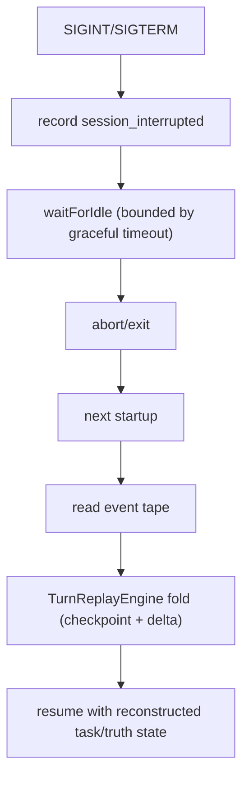
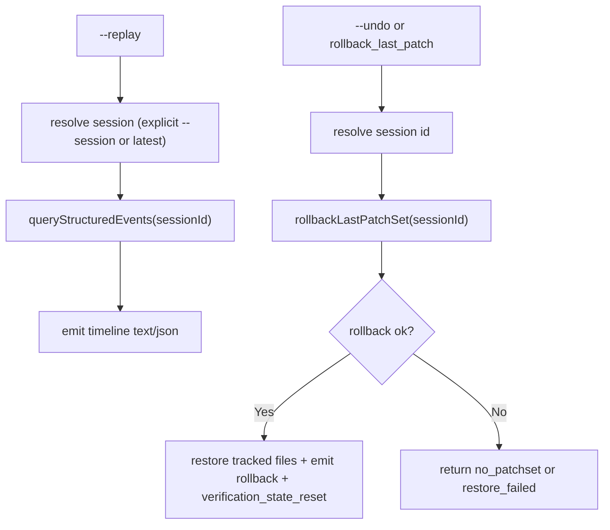

# Control And Data Flow

This document models runtime control flow and persistence flow for normal
execution, interruption recovery, replay, and rollback.

## Default Session Flow (Extensions Enabled)

## `--no-extensions` Flow (Reduced Orchestration)

This mode keeps runtime/tool execution available, but extension-layer gates and
transforms are intentionally bypassed.

## Persistence Data Flow

## Interruption and Recovery Flow

## Replay and Rollback Flow

