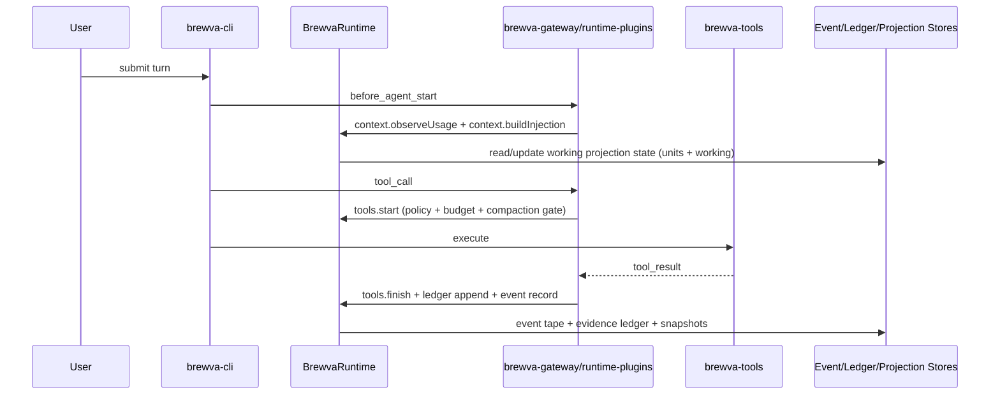
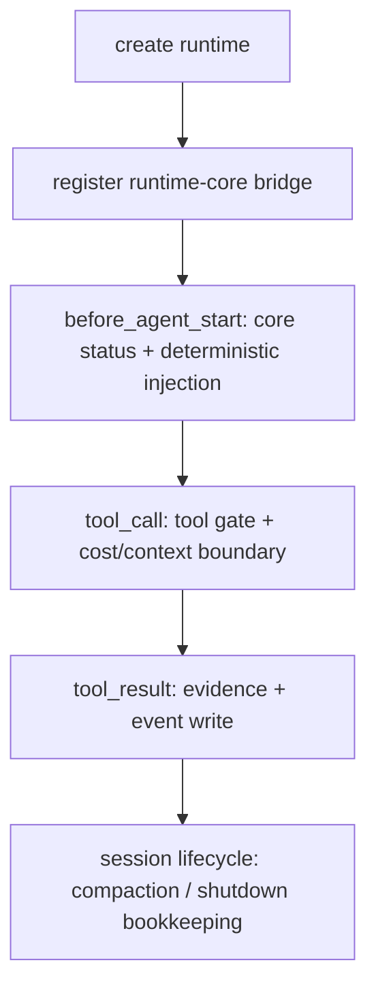
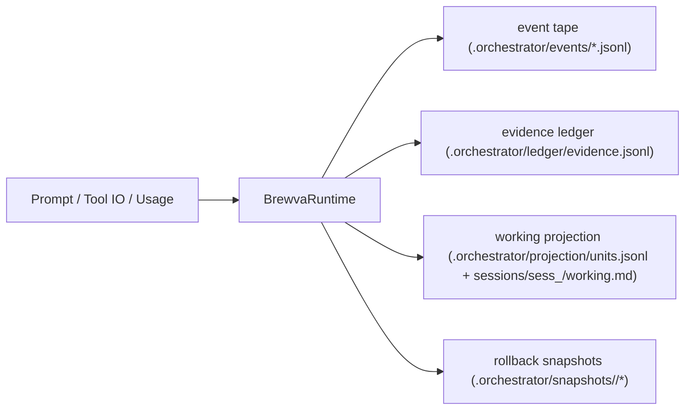
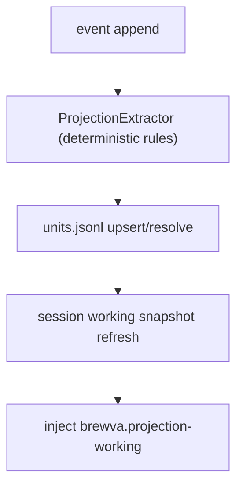
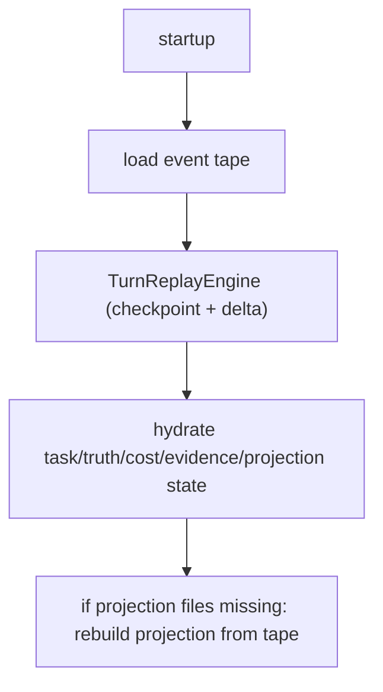
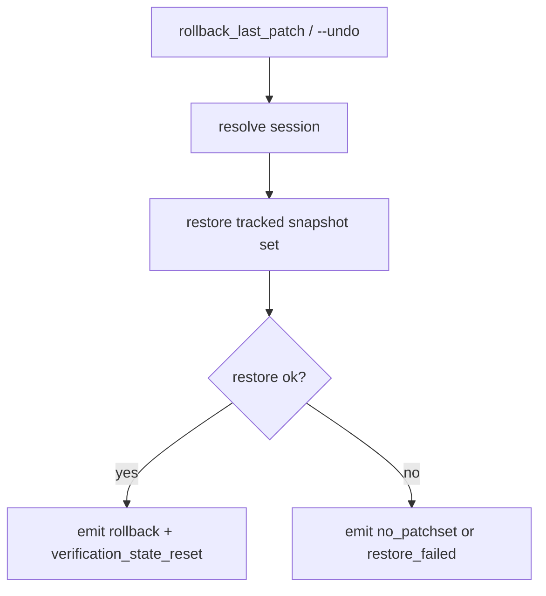

# Control And Data Flow

This document models governance-first runtime flow and persistence boundaries.

## Default Session Flow (Extensions Enabled)

```mermaid
sequenceDiagram
  participant U as User
  participant CLI as brewva-cli
  participant RT as BrewvaRuntime
  participant EXT as brewva-gateway/runtime-plugins
  participant TOOLS as brewva-tools
  participant STORE as Event/Ledger/Projection Stores

  U->>CLI: submit turn
  CLI->>EXT: before_agent_start
  EXT->>RT: context.observeUsage + context.buildInjection
  RT->>STORE: read/update working projection state (units + working)
  CLI->>EXT: tool_call
  EXT->>RT: tools.start (policy + budget + compaction gate)
  CLI->>TOOLS: execute
  TOOLS-->>EXT: tool_result
  EXT->>RT: tools.finish + ledger append + event record
  RT->>STORE: event tape + evidence ledger + snapshots
```

## Core Bridge Flow (`--no-addons`)

```mermaid
flowchart TD
  A["create runtime"] --> B["register runtime-core bridge"]
  B --> C["before_agent_start: core status + deterministic injection"]
  C --> D["tool_call: tool gate + cost/context boundary"]
  D --> E["tool_result: evidence + event write"]
  E --> F["session lifecycle: compaction / shutdown bookkeeping"]
```

## Persistence Flow

```mermaid
flowchart LR
  IN["Prompt / Tool IO / Usage"] --> RT["BrewvaRuntime"]
  RT --> EV["event tape (.orchestrator/events/*.jsonl)"]
  RT --> LD["evidence ledger (.orchestrator/ledger/evidence.jsonl)"]
  RT --> MEM["working projection (.orchestrator/projection/units.jsonl + sessions/sess_<id>/working.md)"]
  RT --> SNAP["rollback snapshots (.orchestrator/snapshots/<session>/*)"]
```

## Working Projection Flow

```mermaid
flowchart TD
  EVT["event append"] --> EX["ProjectionExtractor (deterministic rules)"]
  EX --> U["units.jsonl upsert/resolve"]
  U --> W["session working snapshot refresh"]
  W --> INJ["inject brewva.projection-working"]
```

## Recovery Flow

```mermaid
flowchart TD
  A["startup"] --> B["load event tape"]
  B --> C["TurnReplayEngine (checkpoint + delta)"]
  C --> D["hydrate task/truth/cost/evidence/projection state"]
  D --> E["if projection files missing: rebuild projection from tape"]
```

## Rollback Flow

```mermaid
flowchart TD
  A["rollback_last_patch / --undo"] --> B["resolve session"]
  B --> C["restore tracked snapshot set"]
  C --> D{"restore ok?"}
  D -->|yes| E["emit rollback + verification_state_reset"]
  D -->|no| F["emit no_patchset or restore_failed"]
```
