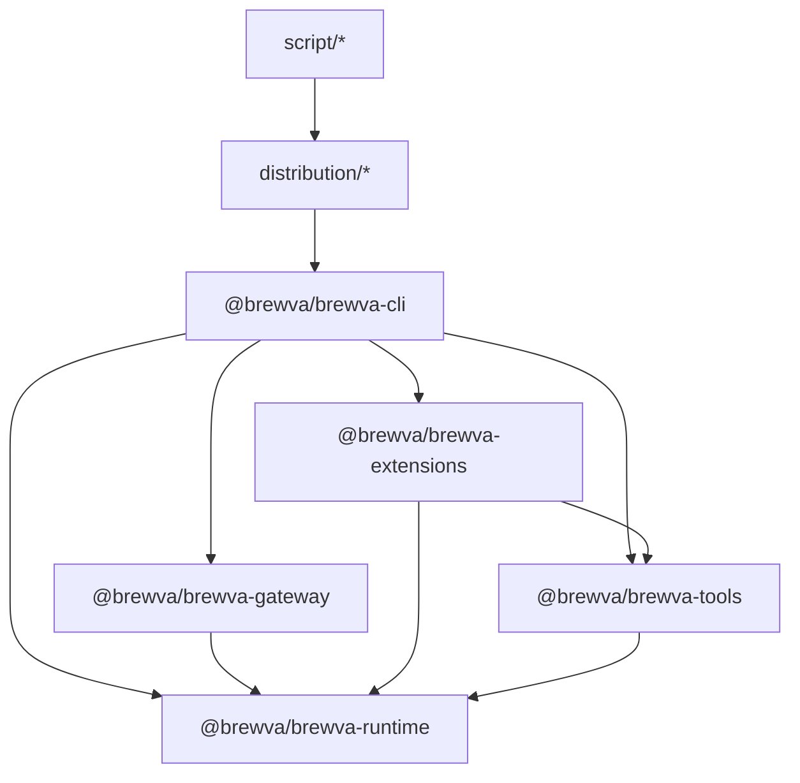

# System Architecture

This document describes the implemented architecture of Brewva based on
current package dependencies and runtime wiring.

## Design Principles And Drivers

### 1) Agent Autonomy With Explicit Pressure Contracts

The runtime exposes three orthogonal control loops and keeps control actions in
the agent loop:

| Pipeline                | Resource                                                       | Pressure Signal                          | Agent/Runtime Action                                                 |
| ----------------------- | -------------------------------------------------------------- | ---------------------------------------- | -------------------------------------------------------------------- |
| **State Tape**          | Append-only operational state (task/truth/verification/cost)   | `tape_pressure`                          | `tape_handoff` marks semantic phase boundaries                       |
| **Message Buffer**      | LLM context window (user/assistant/tool messages)              | `context_pressure`                       | `session_compact` compacts conversation history                      |
| **Cognitive Inference** | Runtime cognition budget for semantic relation/ranking/lessons | cognitive budget status (calls + tokens) | `CognitivePort` path or deterministic fallback under budget pressure |

In extension-enabled execution, runtime injects context policy as explicit
contract text and pressure state, but does not silently compact on behalf of
the agent. Memory/context surfaces are explicit and traceable via
`brewva.identity`, `brewva.truth`, `brewva.task-state`,
`brewva.tool-failures`, and `brewva.memory`.

Cognitive behavior follows a dual-path model:

- `memory.cognitive.mode="off"`: deterministic mode only.
- `memory.cognitive.mode="shadow"`: cognition runs and is audited but cannot
  mutate runtime decisions.
- `memory.cognitive.mode="active"`: cognition can influence decisions within
  budget, with deterministic fallback on error/exhaustion.

Implementation anchors:

- `packages/brewva-runtime/src/runtime.ts`
- `packages/brewva-runtime/src/context/budget.ts`
- `packages/brewva-extensions/src/context-transform.ts`
- `packages/brewva-cli/src/session.ts`

### 2) Tape-First Recovery And Replay

Runtime state is recovered from append-only tape events instead of opaque
process-local blobs:

- Per turn: replay from checkpoints + deltas reconstructs task/truth/cost and
  related runtime state.
- On startup: session hydration rebuilds counters, warning dedupe sets, and
  budget states from persisted tape/events.
- For memory artifacts: missing projection files can be rebuilt from
  `memory_*` snapshot semantics and extraction fallback.
- Checkpoints optimize replay speed; anchors remain semantic phase markers
  controlled by the agent.

Implementation anchors:

- `packages/brewva-runtime/src/tape/replay-engine.ts`
- `packages/brewva-runtime/src/channels/turn-wal.ts`
- `packages/brewva-runtime/src/events/store.ts`
- `packages/brewva-cli/src/index.ts`

### 3) Contract-Driven Execution Boundaries

Execution is constrained by explicit contracts at each layer:

- Skill contracts define allowed tools, budget envelope, and required outputs.
- Verification gates (`quick` / `standard` / `strict`) block completion until
  required evidence is recorded.
- Fail-closed context handling blocks unsafe continuation when context pressure
  is critical and compaction contract is not satisfied.
- Evidence ledger is append-only; missing evidence is treated as a hard
  completion blocker.
- Budget policies constrain context injection, session cost, and parallel
  runtime behavior.

Implementation anchors:

- `packages/brewva-runtime/src/security/tool-policy.ts`
- `packages/brewva-runtime/src/ledger/evidence-ledger.ts`
- `packages/brewva-runtime/src/runtime.ts`
- `packages/brewva-tools/src/skill-complete.ts`

### 4) Projection-Based Memory (Derived, Traceable, Reviewable)

Memory is a projection layer derived from event tape semantics:

- Source of truth is tape events under `.orchestrator/events/`.
- Projection outputs (`Unit`, `Crystal`, `Insight`, `EVOLVES`) are persisted as
  derived artifacts under `.orchestrator/memory/`.
- Projection snapshots (`memory_*`) keep replay/rebuild paths deterministic even
  when projection artifacts are missing.
- Working-memory context can be injected with budget-aware truncation/drop
  behavior in extension-enabled profile.
- EVOLVES effects remain review-gated before mutating stable unit state.

Event stream visibility remains level-based via
`infrastructure.events.level`:

- `audit`: replay/audit-critical stream.
- `ops`: audit stream + operational transitions and warnings.
- `debug`: full diagnostic details including cognitive and scan telemetry.

Implementation anchors:

- `packages/brewva-runtime/src/memory/engine.ts`
- `packages/brewva-runtime/src/memory/store.ts`
- `packages/brewva-runtime/src/cost/tracker.ts`
- `packages/brewva-extensions/src/event-stream.ts`

### 5) Workspace-First Orchestration

Orchestration is modeled as workspace state first, process memory second:

- Worker state is isolated by agent/session namespaces to avoid contamination.
- Callback routing and approval state are persisted for restart continuity.
- Runtime lifecycle restoration relies on persisted records and deterministic
  rebuild paths.
- Cross-agent coordination and channel boundaries remain explicit in evented
  surfaces for replay and postmortem analysis.

Implementation anchors:

- `packages/brewva-gateway/src`
- `packages/brewva-ingress/src/telegram-ingress.ts`
- `packages/brewva-ingress/src/telegram-webhook-worker.ts`
- `packages/brewva-runtime/src/runtime.ts`

## Package Dependency Graph

## Responsibility Slices

- **Session entry and mode control (`@brewva/brewva-cli`)**
  - CLI flags, interactive/print/json modes, replay/undo, signal handling.
  - Gateway subcommand dispatch (`brewva gateway ...`).
  - Session bootstrap and extension-enabled/disabled selection.
- **Control-plane daemon (`@brewva/brewva-gateway`)**
  - Local daemon lifecycle management (`start`/`status`/`stop`/`rotate-token`/`logs`).
  - Typed WebSocket protocol surface (frame validation, method/event schema, traceId propagation).
  - Connection authentication (challenge-response) and connection revocation after token rotation.
  - Session worker supervision, heartbeat policy reload, PID/state-file management.
- **Lifecycle orchestration (`@brewva/brewva-extensions`)**
  - Event stream persistence hooks.
  - Context transform and compaction gate behavior.
  - Memory bridge hooks (`agent_end` refresh, `session_shutdown` cache clear).
  - Tool-call quality gate and input sanitization.
  - Ledger writer and completion guard hooks.
- **Tool surface (`@brewva/brewva-tools`)**
  - Runtime-aware tool definitions (LSP/AST, tape, ledger, task, skill, rollback, memory review/dismiss).
  - Tool-side scan telemetry (`tool_parallel_read`) and runtime APIs.
- **Runtime core (`@brewva/brewva-runtime`)**
  - Public facade: `BrewvaRuntime` (`packages/brewva-runtime/src/runtime.ts`) stays as external API entry.
  - Channel contracts are exposed via dedicated subpath entry `@brewva/brewva-runtime/channels`
    (implemented by `packages/brewva-runtime/src/channels.ts`) to keep root runtime exports focused.
  - Internal logic is split into domain services (`packages/brewva-runtime/src/services/*`) and wired by constructor injection.
  - Session-local ephemeral maps are centralized in `RuntimeSessionStateStore` (`packages/brewva-runtime/src/services/session-state.ts`).
  - Scheduler boundary uses a narrow runtime port (`SchedulerRuntimePort`) instead of direct runtime coupling.
  - Skill contracts/selection, tool policy enforcement, verification gate.
  - Evidence ledger + truth/task event-sourced state.
  - Tape replay (`checkpoint + delta`), context budget, parallel budget, cost tracking.
  - Memory projection engine (units/crystals/insights/evolves), working-memory publication, recall retrieval.
  - Rollback tracking via file snapshots.
  - Canonical runtime configuration contract (`BrewvaConfig`), including startup UI policy (`ui.quietStartup`).
- **Distribution/build packaging (`distribution/*`, `script/*`)**
  - Platform launcher packages and binary build/verification scripts.

## Execution Profiles

- **Default profile (`extensions enabled`)**
  - `createBrewvaExtension()` registers tools and all lifecycle handlers.
  - Runtime behavior is mediated through extension hooks (`before_agent_start`,
    `tool_call`, `tool_result`, `agent_end`, etc.).
  - During `before_agent_start`, runtime may refresh memory projections and inject
    merged memory context (`brewva.memory`, composed from working-memory + recall blocks)
    under context-budget policy.
  - On `agent_end`, memory bridge triggers an additional memory refresh pass to
    keep `working.md` aligned with the latest tape-derived projections.
  - Event tape keeps raw and semantic layers separated: raw lifecycle signals
    come from `event-stream`, while derived tool-result semantics are persisted
    as `tool_result_recorded` by runtime/ledger writer.
- **Direct-tool profile (`--no-extensions`)**
  - Tools are registered directly from `buildBrewvaTools()`.
  - CLI installs `createRuntimeCoreBridgeExtension()` to run core tool hooks
    (`quality-gate`, `ledger-writer`, compact lifecycle bridge) without full extension stack.
  - Runtime core bridge also handles `before_agent_start` with a minimal
    autonomy contract + `[CoreTapeStatus]` pressure/action block.
  - Runtime core path (`runtime.tools.start` / `runtime.tools.finish`) enforces tool policy,
    critical context-compaction gate, tool-call accounting, patch tracking, and
    tool-result ledger persistence.
  - Memory ingest on `runtime.events.record()` remains active (units/crystals/insights/evolves
    can still be projected), but extension presentation hooks are disabled.
  - CLI installs `registerRuntimeCoreEventBridge()` for lifecycle and
    assistant-usage telemetry.
  - Extension-only presentation hooks (`context-transform` memory injection,
    completion guard, notification, memory bridge) remain disabled by design.

## Configuration-to-UI Flow

`BrewvaConfig` is the source of truth for startup UI defaults. The flow is:

1. Runtime loads and normalizes config (`loadBrewvaConfig` + `normalizeBrewvaConfig`).
2. CLI session bootstrap reads `runtime.config.ui`.
3. CLI applies `runtime.config.ui` into upstream `SettingsManager` overrides.
4. Interactive mode startup rendering uses `quietStartup`.

Key implementation points:

- Runtime types/defaults/normalization:
  - `packages/brewva-runtime/src/types.ts`
  - `packages/brewva-runtime/src/config/defaults.ts`
  - `packages/brewva-runtime/src/config/normalize.ts`
- Session bootstrap wiring:
  - `packages/brewva-cli/src/session.ts`
- Distribution global seed defaults:
  - `distribution/brewva/postinstall.mjs`

## Memory Projection Path

Memory is implemented as a derived projection layer over the event tape:

1. Runtime appends semantic events to `.orchestrator/events/<session>.jsonl`.
2. Memory extractor ingests events and upserts/merges units into `.orchestrator/memory/units.jsonl`.
3. Crystal compiler and insight generation update `crystals.jsonl` / `insights.jsonl`.
4. In shadow mode, evolves candidates are written to `evolves.jsonl`; manual
   review may supersede units and emit additional memory events.
5. Working snapshot is published to `.orchestrator/memory/working.md`; runtime then
   builds a merged `brewva.memory` injection block (working snapshot + recall hits).

This path is deterministic, auditable, and restart-safe: projection artifacts are
persisted on disk and can also be rebuilt from tape-backed `memory_*` snapshot
events when projection files are missing.

Related docs:

- `docs/journeys/memory-projection-and-recall.md`
- `docs/reference/configuration.md`

## Dependency Direction Rules

- Runtime package should stay independent from other workspace packages.
- Tools and extensions can depend on runtime, but runtime must not depend on them.
- CLI may orchestrate runtime/tools/extensions, but policy decisions should live
  in runtime and extension hooks.
- `reference` docs are normative for contracts; `guide/journeys` are operational views.

## Architectural Objectives

- Deterministic recoverability after interruption
- Observable execution timeline and evidence chain
- Contract-driven execution safety
- Bounded context and bounded cost under long-running sessions
- Traceable, reviewable memory evolution over append-only tape data
