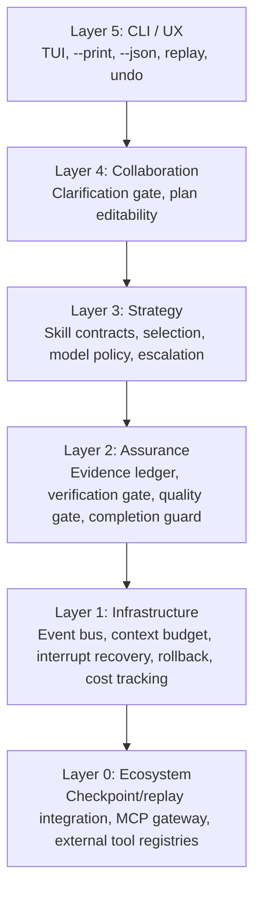

# System Architecture

This document defines the architectural model of `pi-roaster` as a layered AI-native CLI runtime.

## Layered Architecture

## Package-to-Layer Mapping

- Layer 5: `packages/roaster-cli/src/index.ts`
- Layer 4: interaction policy is currently distributed across runtime + extensions:
  - `packages/roaster-runtime/src/runtime.ts`
  - `packages/roaster-extensions/src/completion-guard.ts`
- Layer 3:
  - `packages/roaster-runtime/src/skills/contract.ts`
  - `packages/roaster-runtime/src/skills/registry.ts`
  - `packages/roaster-runtime/src/skills/selector.ts`
- Layer 2:
  - `packages/roaster-runtime/src/ledger/evidence-ledger.ts`
  - `packages/roaster-runtime/src/verification/gate.ts`
  - `packages/roaster-extensions/src/quality-gate.ts`
  - `packages/roaster-extensions/src/completion-guard.ts`
- Layer 1:
  - `packages/roaster-runtime/src/events/store.ts`
  - `packages/roaster-runtime/src/context/budget.ts`
  - `packages/roaster-runtime/src/state/snapshot-store.ts`
  - `packages/roaster-runtime/src/state/file-change-tracker.ts`
  - `packages/roaster-runtime/src/cost/tracker.ts`
- Layer 0:
  - `distribution/*`
  - `packages/roaster-tools/src/index.ts`

## Dependency Direction Rules

- Higher layers can depend on lower layers.
- Lower layers must not depend on higher layers.
- Policy logic should be implemented once in runtime or extension hooks, not duplicated in tools.
- `reference` docs are normative for contracts; `guide/journeys` are operational views.

## Architectural Objectives

- Deterministic recoverability after interruption
- Observable execution timeline and evidence chain
- Contract-driven execution safety
- Bounded context and bounded cost under long-running sessions
