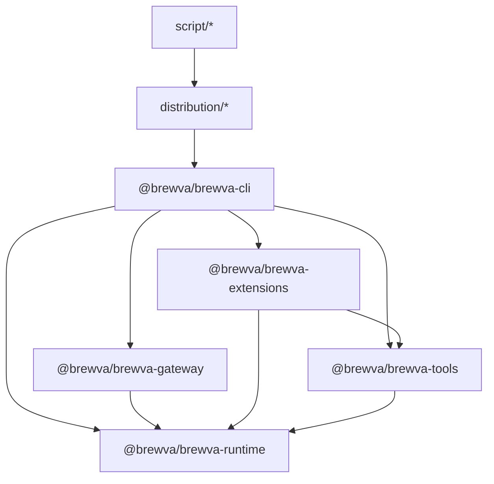

# System Architecture

This document describes the implemented architecture of Brewva based on
current package dependencies and runtime wiring.

## Package Dependency Graph

## Responsibility Slices

- **Session entry and mode control (`@brewva/brewva-cli`)**
  - CLI flags, interactive/print/json modes, replay/undo, signal handling.
  - Gateway subcommand dispatch (`brewva gateway ...`).
  - Session bootstrap and extension-enabled/disabled selection.
- **Control-plane daemon (`@brewva/brewva-gateway`)**
  - Local daemon lifecycle management (`start`/`status`/`stop`/`rotate-token`/`logs`).
  - Typed WebSocket protocol surface (frame validation, method/event schema, traceId propagation).
  - Connection authentication (challenge-response) and connection revocation after token rotation.
  - Session worker supervision, heartbeat policy reload, PID/state-file management.
- **Lifecycle orchestration (`@brewva/brewva-extensions`)**
  - Event stream persistence hooks.
  - Context transform and compaction gate behavior.
  - Memory bridge hooks (`agent_end` refresh, `session_shutdown` cache clear).
  - Tool-call quality gate and input sanitization.
  - Ledger writer and completion guard hooks.
- **Tool surface (`@brewva/brewva-tools`)**
  - Runtime-aware tool definitions (LSP/AST, tape, ledger, task, skill, rollback, memory review/dismiss).
  - Tool-side scan telemetry (`tool_parallel_read`) and runtime APIs.
- **Runtime core (`@brewva/brewva-runtime`)**
  - Public facade: `BrewvaRuntime` (`packages/brewva-runtime/src/runtime.ts`) stays as external API entry.
  - Internal logic is split into domain services (`packages/brewva-runtime/src/services/*`) and wired by constructor injection.
  - Session-local ephemeral maps are centralized in `RuntimeSessionStateStore` (`packages/brewva-runtime/src/services/session-state.ts`).
  - Scheduler boundary uses a narrow runtime port (`SchedulerRuntimePort`) instead of direct runtime coupling.
  - Skill contracts/selection, tool policy enforcement, verification gate.
  - Evidence ledger + truth/task event-sourced state.
  - Tape replay (`checkpoint + delta`), context budget, parallel budget, cost tracking.
  - Memory projection engine (units/crystals/insights/evolves), working-memory publication, recall retrieval.
  - Rollback tracking via file snapshots.
  - Canonical runtime configuration contract (`BrewvaConfig`), including startup UI policy (`ui.quietStartup`, `ui.collapseChangelog`).
- **Distribution/build packaging (`distribution/*`, `script/*`)**
  - Platform launcher packages and binary build/verification scripts.

## Execution Profiles

- **Default profile (`extensions enabled`)**
  - `createBrewvaExtension()` registers tools and all lifecycle handlers.
  - Runtime behavior is mediated through extension hooks (`before_agent_start`,
    `tool_call`, `tool_result`, `agent_end`, etc.).
  - During `before_agent_start`, runtime may refresh memory projections and inject
    `brewva.working-memory` / `brewva.memory-recall` under context-budget policy.
  - On `agent_end`, memory bridge triggers an additional memory refresh pass to
    keep `working.md` aligned with the latest tape-derived projections.
  - Event tape keeps raw and semantic layers separated: raw lifecycle signals
    come from `event-stream`, while derived tool-result semantics are persisted
    as `tool_result_recorded` by runtime/ledger writer.
- **Direct-tool profile (`--no-extensions`)**
  - Tools are registered directly from `buildBrewvaTools()`.
  - CLI installs `createRuntimeCoreBridgeExtension()` to run core tool hooks
    (`quality-gate`, `ledger-writer`, compact lifecycle bridge) without full extension stack.
  - Runtime core path (`startToolCall`/`finishToolCall`) enforces tool policy,
    critical context-compaction gate, tool-call accounting, patch tracking, and
    tool-result ledger persistence.
  - Memory ingest on `recordEvent()` remains active (units/crystals/insights/evolves
    can still be projected), but extension presentation hooks are disabled.
  - CLI installs `registerRuntimeCoreEventBridge()` for lifecycle and
    assistant-usage telemetry.
  - Extension-only presentation hooks (context-injection message, completion
    guard, notification, memory bridge) remain disabled by design.

## Configuration-to-UI Flow

`BrewvaConfig` is the source of truth for startup UI defaults. The flow is:

1. Runtime loads and normalizes config (`loadBrewvaConfig` + `normalizeBrewvaConfig`).
2. CLI session bootstrap reads `runtime.config.ui`.
3. CLI applies `runtime.config.ui` into upstream `SettingsManager` overrides.
4. Interactive mode startup rendering uses those settings (`quietStartup`, `collapseChangelog`).

Key implementation points:

- Runtime types/defaults/normalization:
  - `packages/brewva-runtime/src/types.ts`
  - `packages/brewva-runtime/src/config/defaults.ts`
  - `packages/brewva-runtime/src/config/normalize.ts`
- Session bootstrap wiring:
  - `packages/brewva-cli/src/session.ts`
- Distribution global seed defaults:
  - `distribution/brewva/postinstall.mjs`

## Memory Projection Path

Memory is implemented as a derived projection layer over the event tape:

1. Runtime appends semantic events to `.orchestrator/events/<session>.jsonl`.
2. Memory extractor ingests events and upserts/merges units into `.orchestrator/memory/units.jsonl`.
3. Crystal compiler and insight generation update `crystals.jsonl` / `insights.jsonl`.
4. In shadow mode, evolves candidates are written to `evolves.jsonl`; manual
   review may supersede units and emit additional memory events.
5. Working snapshot is published to `.orchestrator/memory/working.md` and then
   injected as `brewva.working-memory`; retrieval may emit `brewva.memory-recall`.

This path is deterministic, auditable, and restart-safe because each projection
is persisted and can be rehydrated independently of process-local caches.

Related docs:

- `docs/journeys/memory-projection-and-recall.md`
- `docs/reference/configuration.md`

## Dependency Direction Rules

- Runtime package should stay independent from other workspace packages.
- Tools and extensions can depend on runtime, but runtime must not depend on them.
- CLI may orchestrate runtime/tools/extensions, but policy decisions should live
  in runtime and extension hooks.
- `reference` docs are normative for contracts; `guide/journeys` are operational views.

## Architectural Objectives

- Deterministic recoverability after interruption
- Observable execution timeline and evidence chain
- Contract-driven execution safety
- Bounded context and bounded cost under long-running sessions
- Traceable, reviewable memory evolution over append-only tape data
