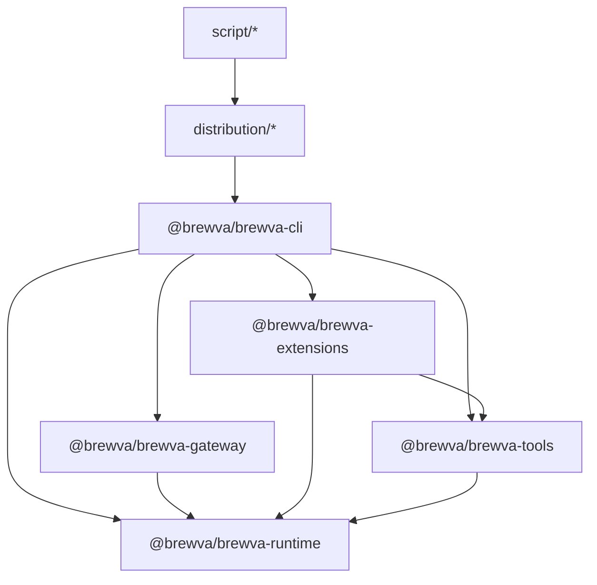

# System Architecture

This document describes the implemented architecture of Brewva based on
current package dependencies and runtime wiring.

## Design Principles And Drivers

Principles are organized by permanence. Durable principles are
model-capability-independent and will not simplify as models improve.
Adaptive principles explicitly anticipate that their mechanisms may retire
as the environment changes. The governing meta-principle binds all adaptive
mechanisms to observable exit conditions.

### Durable Principles

#### 1) Tape-First Recovery And Replay

Runtime state is recovered from append-only tape events instead of opaque
process-local blobs:

- Per turn: replay from checkpoints + deltas reconstructs task/truth/cost and
  related runtime state.
- On startup: session hydration rebuilds counters, warning dedupe sets, and
  budget states from persisted tape/events.
- For memory artifacts: missing projection files can be rebuilt from
  `memory_*` snapshot semantics and extraction fallback.
- Checkpoints optimize replay speed; anchors remain semantic phase markers
  controlled by the agent.

Implementation anchors:

- `packages/brewva-runtime/src/tape/replay-engine.ts`
- `packages/brewva-runtime/src/channels/turn-wal.ts`
- `packages/brewva-runtime/src/events/store.ts`
- `packages/brewva-cli/src/index.ts`

#### 2) Contract-Driven Execution Boundaries

Execution is constrained by explicit contracts at each layer:

- Skill contracts define allowed tools, budget envelope, and required outputs.
- Verification gates (`quick` / `standard` / `strict`) block completion until
  required evidence is recorded.
- Fail-closed context handling blocks unsafe continuation when context pressure
  is critical and compaction contract is not satisfied.
- Evidence ledger is append-only; missing evidence is treated as a hard
  completion blocker.
- Budget policies constrain context injection, session cost, and parallel
  runtime behavior.

Implementation anchors:

- `packages/brewva-runtime/src/security/tool-policy.ts`
- `packages/brewva-runtime/src/ledger/evidence-ledger.ts`
- `packages/brewva-runtime/src/runtime.ts`
- `packages/brewva-tools/src/skill-complete.ts`

#### 3) Skill-First Orchestration With Dynamic Loading

Execution is skill-first and prompt-triggered, not prompt-first:

- Prompt text is treated as a dispatch signal for selecting/activating
  executable skill contracts.
- Skill contracts remain the primary unit for tool policy, budget envelope, and
  completion requirements.
- Skill activation is dynamic (`skill_load`) and scoped to session state instead
  of preloading all capabilities into context.
- Context injection and replay stay skill-addressable through
  `skill_activated`/`skill_completed` tape events.

This keeps orchestration deterministic and auditable while reducing unnecessary
context expansion from prompt-only routing.

Implementation anchors:

- `packages/brewva-runtime/src/runtime.ts`
- `packages/brewva-runtime/src/services/skill-lifecycle.ts`
- `packages/brewva-runtime/src/skills/registry.ts`
- `packages/brewva-runtime/src/skills/selector.ts`
- `packages/brewva-tools/src/skill-load.ts`
- `packages/brewva-tools/src/skill-complete.ts`

#### 4) Projection-Based Memory (Derived, Traceable, Reviewable)

Memory is a projection layer derived from event tape semantics:

- Source of truth is tape events under `.orchestrator/events/`.
- Projection outputs (`Unit`, `Crystal`, `Insight`, `EVOLVES`) are persisted as
  derived artifacts under `.orchestrator/memory/`.
- Projection snapshots (`memory_*`) keep replay/rebuild paths deterministic even
  when projection artifacts are missing.
- Projection refresh state is reason-tagged (`dirtyEntries`) so refresh causes
  stay explicit (`topic + reason + updatedAt`) instead of opaque dirty flags.
- Working-memory and recall context are injected as split semantic sources
  (`brewva.memory-working` + `brewva.memory-recall`) with pressure-aware recall
  fallback and zone-aware budget/truncation behavior in extension-enabled profile.
- Open insights may expand recall query terms before retrieval
  (`memory_recall_query_expanded`), tightening retrieval around unresolved context.
- External recall remains an explicit boundary (`brewva.rag-external`): trigger
  requires skill-tag + low internal score + zone budget, and write-back stores
  lower-confidence external units. When enabled and no custom provider is
  injected, runtime auto-wires a built-in crystal-lexical recall adapter
  (feature-hashing bag-of-words; zero-dependency deterministic fallback) over global crystal projection artifacts.
- EVOLVES effects remain review-gated before mutating stable unit state.
- Quality evaluation is also projection-based: recall/rerank quality is derived
  offline from tape events rather than hot-path counters.

Event stream visibility remains level-based via
`infrastructure.events.level`:

- `audit`: replay/audit-critical stream.
- `ops`: audit stream + operational transitions and warnings.
- `debug`: full diagnostic details including scan telemetry and most
  cognitive diagnostics.
- Exception: `cognitive_relevance_ranking*` remains `ops`-visible for
  shadow-to-active rerank evaluation.

Implementation anchors:

- `packages/brewva-runtime/src/memory/engine.ts`
- `packages/brewva-runtime/src/memory/store.ts`
- `packages/brewva-runtime/src/cost/tracker.ts`
- `packages/brewva-extensions/src/event-stream.ts`

#### 5) Workspace-First Orchestration

Orchestration is modeled as workspace state first, process memory second:

- Worker state is isolated by agent/session namespaces to avoid contamination.
- Callback routing and approval state are persisted for restart continuity.
- Runtime lifecycle restoration relies on persisted records and deterministic
  rebuild paths.
- Cross-agent coordination and channel boundaries remain explicit in evented
  surfaces for replay and postmortem analysis.

Implementation anchors:

- `packages/brewva-gateway/src`
- `packages/brewva-ingress/src/telegram-ingress.ts`
- `packages/brewva-ingress/src/telegram-webhook-worker.ts`
- `packages/brewva-runtime/src/runtime.ts`

### Governing Meta-Principle

#### 6) Mechanism Metabolism

Every optimization mechanism in the runtime must carry its own exit condition.
A mechanism that cannot demonstrate measurable benefit should degrade to a
no-op or be retired, without affecting system correctness.

This principle exists because context management complexity tends to
self-reproduce: each mechanism introduces failure modes that motivate further
mechanisms. Left unchecked, the optimization layer becomes a permanent
dependency rather than an optional accelerator.

Concrete enforcement:

- **Retirement policies** (`ContextRetirementPolicy`): each transitional
  mechanism (adaptive zones, stability monitor) declares a metric key, a
  disable-below threshold, a re-enable-above threshold, a check interval, and
  a minimum sample size. The `ContextEvolutionManager` evaluates these from
  7-day event windows and emits `context_evolution_feature_disabled` /
  `context_evolution_feature_reenabled` on transitions.
- **Passthrough default**: the context strategy must be able to degrade to
  `passthrough` (no zone budgets, no injection token cap, no adaptive loop)
  at any time. Correctness does not depend on the optimization layer.
- **TTL-scoped overrides**: strategy overrides written by the tuner skill
  carry an `expiresAt` timestamp. Expired overrides are silently ignored.
  No override can persist without explicit renewal.
- **Durable principles are exempt**: tape, contracts, ledger, and skill
  orchestration do not carry retirement policies because they serve system
  integrity, not model-capability compensation.

Implementation anchors:

- `packages/brewva-runtime/src/context/evolution-manager.ts`
- `packages/brewva-runtime/src/types.ts` (`ContextRetirementPolicy`)
- `packages/brewva-runtime/src/config/defaults.ts` (retirement defaults)
- `skills/project/brewva-self-improve/SKILL.md` (observer/tuner cadence)

### Capability-Adaptive Principles

The following principles describe mechanisms that compensate for current model
limitations (bounded context windows, quality degradation under long context).
As models improve and costs decrease, these mechanisms are expected to
progressively simplify toward passthrough. Their design anticipates this
trajectory.

#### 7) Agent Autonomy With Pressure Transparency

The runtime exposes resource pressure to the agent as explicit contract text
rather than silently managing it. The agent decides how to respond.

Four orthogonal pressure surfaces:

| Pipeline                    | Resource                      | Pressure Signal                | Agent Action                              |
| --------------------------- | ----------------------------- | ------------------------------ | ----------------------------------------- |
| **State Tape**              | Append-only operational state | `tape_pressure`                | `tape_handoff` marks phase boundaries     |
| **Message Buffer**          | LLM context window            | `context_pressure`             | `session_compact` compacts history        |
| **Context Injection Arena** | Semantic injection budget     | zone/arena SLO + injection cap | strategy-dependent (see Principle 8)      |
| **Cognitive Inference**     | Runtime cognition budget      | cognitive budget status        | `CognitivePort` or deterministic fallback |

Context injection zones (`brewva.identity`, `brewva.truth-static`,
`brewva.truth-facts`, `brewva.task-state`, `brewva.tool-failures`,
`brewva.memory-working`, `brewva.memory-recall`, `brewva.rag-external`) remain
explicit and traceable regardless of which strategy arm is active.

Cognitive behavior follows a tri-mode model:

- `memory.cognitive.mode="off"`: deterministic mode only.
- `memory.cognitive.mode="shadow"`: cognition runs and is audited but cannot
  mutate runtime decisions.
- `memory.cognitive.mode="active"`: cognition can influence decisions within
  budget, with deterministic fallback on error/exhaustion.

Runtime default is `shadow` for safety and observability. Promotion to
`active` is evidence-driven: collect `cognitive_relevance_ranking*` events in
shadow mode, compare deterministic vs cognitive ordering offline, and promote
only when quality deltas are materially positive.

Implementation anchors:

- `packages/brewva-runtime/src/runtime.ts`
- `packages/brewva-runtime/src/context/budget.ts`
- `packages/brewva-runtime/src/context/zones.ts`
- `packages/brewva-runtime/src/services/event-pipeline.ts`
- `packages/brewva-extensions/src/context-transform.ts`
- `packages/brewva-cli/src/session.ts`
- `script/analyze-memory-recall.ts`

#### 8) Adaptive Context Strategy

Context injection is governed by a strategy arm selected per session.
The strategy determines how much management overhead the runtime applies.
As model context windows grow and quality-under-length improves, the expected
trajectory is `managed → hybrid → passthrough`.

| Arm             | Zone Budgets | Adaptive Controller | Injection Token Cap | Stability Monitor | When                        |
| --------------- | ------------ | ------------------- | ------------------- | ----------------- | --------------------------- |
| **managed**     | enforced     | active              | enforced            | active            | small context windows       |
| **hybrid**      | bypassed     | bypassed            | enforced            | bypassed          | medium context windows      |
| **passthrough** | bypassed     | bypassed            | bypassed            | bypassed          | large context windows (1M+) |

Strategy arm resolution (`ContextEvolutionManager.resolve()`):

1. TTL-scoped override match (model + task class) from
   `.brewva/strategy/context-strategy.json`.
2. Auto-select by `contextWindow` size if `strategy.enableAutoByContextWindow`
   is enabled (default thresholds: hybrid ≥ 256K, passthrough ≥ 1M).
3. Fall back to `strategy.defaultArm` (default: `managed`).

Within the `managed` arm, the following transitional mechanisms apply. Each
is governed by Principle 6 (Mechanism Metabolism) and may be independently
retired:

- **Zone budget allocation** (`ZoneBudgetAllocator`): pure function
  (`totalBudget + demand + config → allocation`).
- **Adaptive zone controller** (`ZoneBudgetController`): EMA-based
  utilization/truncation feedback that shifts zone caps between turns.
  Subject to `adaptiveZones.retirement`.
- **Floor-unmet cascade**: deterministic relaxation
  (`floorUnmetPolicy.relaxOrder`) → `critical_only` fallback →
  `context_arena_floor_unmet_unrecoverable`.
- **Stability monitor** (`ContextStabilityMonitor`): cross-turn circuit
  breaker. After `consecutiveThreshold` consecutive floor-unmet turns,
  forces `critical_only` planning with periodic recovery probes.
  Subject to `stabilityMonitor.retirement`.
- **Arena SLO** (`arena.maxEntriesPerSession`): deterministic degradation
  (`drop_recall` / `drop_low_priority` / `force_compact`).

Implementation anchors:

- `packages/brewva-runtime/src/context/evolution-manager.ts`
- `packages/brewva-runtime/src/context/arena.ts`
- `packages/brewva-runtime/src/context/stability-monitor.ts`
- `packages/brewva-runtime/src/context/zone-budget.ts`
- `packages/brewva-runtime/src/context/zone-budget-controller.ts`
- `packages/brewva-runtime/src/context/injection-orchestrator.ts`

## Package Dependency Graph

## Responsibility Slices

- **Session entry and mode control (`@brewva/brewva-cli`)**
  - CLI flags, interactive/print/json modes, replay/undo, signal handling.
  - Gateway subcommand dispatch (`brewva gateway ...`).
  - Session bootstrap and extension-enabled/disabled selection.
- **Control-plane daemon (`@brewva/brewva-gateway`)**
  - Local daemon lifecycle management (`start`/`status`/`stop`/`rotate-token`/`logs`).
  - Typed WebSocket protocol surface (frame validation, method/event schema, traceId propagation).
  - Connection authentication (challenge-response) and connection revocation after token rotation.
  - Session worker supervision, heartbeat policy reload, PID/state-file management.
- **Lifecycle orchestration (`@brewva/brewva-extensions`)**
  - Event stream persistence hooks.
  - Context transform and compaction gate behavior.
  - Memory bridge hooks (`agent_end` refresh, `session_shutdown` cache clear).
  - Tool-call quality gate and input sanitization.
  - Ledger writer and completion guard hooks.
- **Tool surface (`@brewva/brewva-tools`)**
  - Runtime-aware tool definitions (LSP/AST, tape, ledger, task, skill, rollback, memory review/dismiss).
  - Tool-side scan telemetry (`tool_parallel_read`) and runtime APIs.
- **Runtime core (`@brewva/brewva-runtime`)**
  - Public facade: `BrewvaRuntime` (`packages/brewva-runtime/src/runtime.ts`) stays as external API entry.
  - Channel contracts are exposed via dedicated subpath entry `@brewva/brewva-runtime/channels`
    (implemented by `packages/brewva-runtime/src/channels.ts`) to keep root runtime exports focused.
  - Internal logic is split into domain services (`packages/brewva-runtime/src/services/*`) and wired by constructor injection.
  - Session-local ephemeral maps are centralized in `RuntimeSessionStateStore` (`packages/brewva-runtime/src/services/session-state.ts`).
  - Scheduler boundary uses a narrow runtime port (`SchedulerRuntimePort`) instead of direct runtime coupling.
  - Skill contracts/selection, tool policy enforcement, verification gate.
  - Evidence ledger + truth/task event-sourced state.
  - Tape replay (`checkpoint + delta`), context budget, parallel budget, cost tracking.
  - Memory projection engine (units/crystals/insights/evolves), working-memory publication, recall retrieval.
  - Rollback tracking via file snapshots.
  - Canonical runtime configuration contract (`BrewvaConfig`), including startup UI policy (`ui.quietStartup`).
- **Distribution/build packaging (`distribution/*`, `script/*`)**
  - Platform launcher packages and binary build/verification scripts.

## Execution Profiles

- **Default profile (`extensions enabled`)**
  - `createBrewvaExtension()` registers tools and all lifecycle handlers.
  - Runtime behavior is mediated through extension hooks (`before_agent_start`,
    `tool_call`, `tool_result`, `agent_end`, etc.).
  - During `before_agent_start`, runtime may refresh memory projections and inject
    split memory context (`brewva.memory-working` + `brewva.memory-recall`)
    under context-budget policy.
  - On `agent_end`, memory bridge triggers an additional memory refresh pass to
    keep `working.md` aligned with the latest tape-derived projections.
  - Event tape keeps raw and semantic layers separated: raw lifecycle signals
    come from `event-stream`, while derived tool-result semantics are persisted
    as `tool_result_recorded` by runtime/ledger writer.
- **Direct-tool profile (`--no-extensions`)**
  - Tools are registered directly from `buildBrewvaTools()`.
  - CLI installs `createRuntimeCoreBridgeExtension()` to run core tool hooks
    (`quality-gate`, `ledger-writer`, compact lifecycle bridge) without full extension stack.
  - Runtime core bridge also handles `before_agent_start` with a minimal
    autonomy contract + `[CoreTapeStatus]` pressure/action block.
  - Runtime core path (`runtime.tools.start` / `runtime.tools.finish`) enforces tool policy,
    critical context-compaction gate, tool-call accounting, patch tracking, and
    tool-result ledger persistence.
  - Memory ingest on `runtime.events.record()` remains active (units/crystals/insights/evolves
    can still be projected), but extension presentation hooks are disabled.
  - CLI installs `registerRuntimeCoreEventBridge()` for lifecycle and
    assistant-usage telemetry.
  - Extension-only presentation hooks (`context-transform` memory injection,
    completion guard, notification, memory bridge) remain disabled by design.

## Configuration-to-UI Flow

`BrewvaConfig` is the source of truth for startup UI defaults. The flow is:

1. Runtime loads and normalizes config (`loadBrewvaConfig` + `normalizeBrewvaConfig`).
2. CLI session bootstrap reads `runtime.config.ui`.
3. CLI applies `runtime.config.ui` into upstream `SettingsManager` overrides.
4. Interactive mode startup rendering uses `quietStartup`.

Key implementation points:

- Runtime types/defaults/normalization:
  - `packages/brewva-runtime/src/types.ts`
  - `packages/brewva-runtime/src/config/defaults.ts`
  - `packages/brewva-runtime/src/config/normalize.ts`
- Session bootstrap wiring:
  - `packages/brewva-cli/src/session.ts`
- Distribution global seed defaults:
  - `distribution/brewva/postinstall.mjs`

## Memory Projection Path

Memory is implemented as a derived projection layer over the event tape:

1. Runtime appends semantic events to `.orchestrator/events/<session>.jsonl`.
2. Memory extractor ingests events and upserts/merges units into `.orchestrator/memory/units.jsonl`.
3. Crystal compiler and insight generation update `crystals.jsonl` / `insights.jsonl`.
4. In shadow mode, evolves candidates are written to `evolves.jsonl`; manual
   review may supersede units and emit additional memory events.
5. Working snapshot is published to `.orchestrator/memory/working.md`; runtime then
   builds split memory injection sources (`brewva.memory-working` + `brewva.memory-recall`).
6. Open insights can expand recall query terms before retrieval
   (`memory_recall_query_expanded`), improving unresolved-topic targeting.
7. If external recall gating passes, runtime queries `ExternalRecallPort`,
   injects `brewva.rag-external`, and writes accepted hits back as
   lower-confidence external units.
8. Projection state persists reason-tagged dirty entries in `state.json` to
   keep refresh triggers explainable and tuneable.
9. Offline evaluation scripts project recall/rerank quality directly from tape
   events (`memory_global_recall`, `cognitive_relevance_ranking*`,
   `context_external_recall_*`).

This path is deterministic, auditable, and restart-safe: projection artifacts are
persisted on disk and can also be rebuilt from tape-backed `memory_*` snapshot
events when projection files are missing.

Related docs:

- `docs/journeys/memory-projection-and-recall.md`
- `docs/reference/configuration.md`

## Dependency Direction Rules

- Runtime package should stay independent from other workspace packages.
- Tools and extensions can depend on runtime, but runtime must not depend on them.
- CLI may orchestrate runtime/tools/extensions, but policy decisions should live
  in runtime and extension hooks.
- `reference` docs are normative for contracts; `guide/journeys` are operational views.

## Architectural Objectives

- Deterministic recoverability after interruption
- Observable execution timeline and evidence chain
- Contract-driven execution safety
- Bounded context and bounded cost under long-running sessions
- Traceable, reviewable memory evolution over append-only tape data
