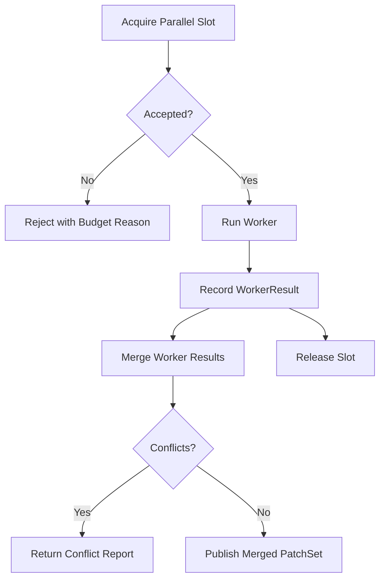

# Journey: Background And Parallelism

## Objective

Execute parallel worker tasks safely under concurrency and merge constraints.

## Key Steps

1. Acquire per-session concurrency budget
2. Record worker outputs and patch metadata
3. Merge results and detect patch conflicts
4. Release slots and clear transient worker state

Note: Use `RoasterRuntime.acquireParallelSlot` to apply per-skill `maxParallel` policy (warn/enforce), not `runtime.parallel.acquire` directly.

## Code Pointers

- Budget manager: `packages/roaster-runtime/src/parallel/budget.ts`
- Result store and merge logic: `packages/roaster-runtime/src/parallel/results.ts`
- Runtime integration APIs: `packages/roaster-runtime/src/runtime.ts`
