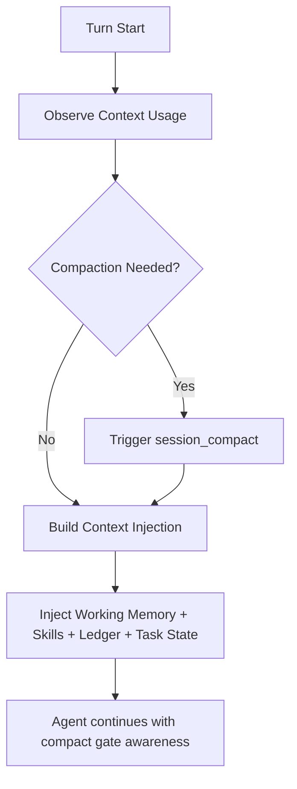

# Journey: Context And Compaction

## Objective

Maintain high-signal context over long-running sessions with explicit agent-managed compaction.

Scope note:

- This journey assumes the extension-enabled profile, where `before_agent_start`
  runs context-transform injection.

## Key Steps

1. Runtime observes context usage on each turn
2. Context budget decides compaction with turn/time cooldown and high-pressure bypass
3. Memory engine incrementally projects units from event tape, including verification status signals, and resolves stale verification signals on `verification_state_reset`, then publishes `working.md`
4. Injection text is built from working memory, skills, ledger digest, and runtime task state blocks
5. Agent triggers `session_compact` explicitly when context pressure is high

## Code Pointers

- Context budget manager: `packages/brewva-runtime/src/context/budget.ts`
- Memory engine: `packages/brewva-runtime/src/memory/engine.ts`
- Context transform hook: `packages/brewva-extensions/src/context-transform.ts`

## Related Journeys

- [Memory Projection And Recall](./memory-projection-and-recall.md)
