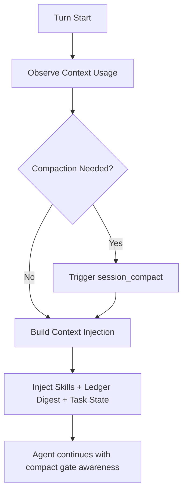

# Journey: Context And Compaction

## Objective

Maintain high-signal context over long-running sessions with explicit agent-managed compaction.

## Key Steps

1. Runtime observes context usage on each turn
2. Context budget decides compaction with turn/time cooldown and high-pressure bypass
3. Injection text is built from skills, ledger digest, and runtime task state blocks
4. Runtime no longer persists or injects prebuilt session/user memory files
5. Agent triggers `session_compact` explicitly when context pressure is high

## Code Pointers

- Context budget manager: `packages/brewva-runtime/src/context/budget.ts`
- Context transform hook: `packages/brewva-extensions/src/context-transform.ts`
