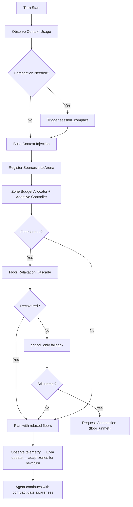
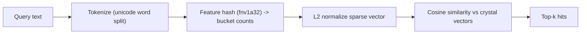

# Journey: Context And Compaction

## Objective

Maintain high-signal context over long-running sessions through an arena-allocator
model with adaptive zone budgeting, deterministic SLO enforcement, and explicit
agent-managed compaction.

Scope note:

- This journey assumes the extension-enabled profile, where `before_agent_start`
  runs context-transform injection.

## Arena Allocator Model

The context window is managed as a contiguous memory block with arena-style semantics:

- **Append-only**: entries are appended per session epoch; superseded entries are
  trimmed by compaction, not deleted in place.
- **Zone-partitioned**: seven semantic zones enforce spatial locality:
  `identity → truth → task_state → tool_failures → memory_working → memory_recall → rag_external`.
- **Budget-constrained**: per-zone floor/cap allocation + global injection cap
  are enforced together by `ZoneBudgetAllocator`.
- **Adaptively tuned**: `ZoneBudgetController` observes truncation/idle ratios
  via EMA and shifts zone caps between turns (donor → receiver).

## Key Control Loops

### 1) Compaction Loop (Pressure → Compact → Reset)

1. Runtime observes context usage on each turn
2. Context budget decides compaction with turn/time cooldown and high-pressure bypass
3. Agent triggers `session_compact` explicitly when context pressure is high
4. On compaction, arena epoch resets and adaptive controller state clears

### 2) Adaptive Zone Budget Loop (Observe → EMA → Shift)

1. After each plan, arena passes telemetry (demand/allocated/accepted per zone)
   to `ZoneBudgetController`
2. Controller updates EMA of truncation and idle ratios per zone
3. After `minTurnsBeforeAdapt` warmup, identifies donors (idle, non-floor-protected)
   and receivers (truncated) and shifts in `stepTokens` increments
4. Next turn's `resolveZoneBudgetConfig()` picks up adjusted caps
5. Emits `context_arena_zone_adapted` event with shift details

### 3) Floor-Unmet Recovery Cascade

When demanded zone floors exceed available injection budget:

1. Relax floors in `floorUnmetPolicy.relaxOrder` (default: `memory_recall → tool_failures → memory_working`)
2. If still unmet: apply `critical_only` fallback (identity + truth + task_state only)
3. If still unmet: emit `context_arena_floor_unmet_unrecoverable` and request
   compaction (bypasses normal cooldown)
4. Recovered cases emit `context_arena_floor_unmet_recovered`

### 4) Arena SLO Enforcement

Arena entry count is bounded by `arena.maxEntriesPerSession` (default 4096).
When the ceiling is hit, `degradationPolicy` fires deterministically:

- `drop_recall`: evict oldest `memory_recall` / `rag_external` entry for non-recall appends; drop incoming entry when the new entry is `memory_recall` / `rag_external`
- `drop_low_priority`: evict oldest `low` / `normal` priority entry
- `force_compact`: wipe all entries and rebuild

SLO enforcement emits `context_arena_slo_enforced` with policy/count details.

### 5) External Recall I/O Boundary

External knowledge retrieval is an explicit I/O boundary, not a parallel prompt path:

1. Trigger: internal memory search score < `minInternalScore` AND skill has
   `external-knowledge` tag
2. Budget: `rag_external` zone (default `max: 0`, disabled by default)
3. Port: `externalRecallPort.search()` — clean abstraction over any retrieval backend
   (runtime auto-wires a crystal-lexical default (feature-hashing bag-of-words; zero-dependency deterministic fallback) over global crystal projections when no custom port is provided)
4. Write-back: results persisted as memory units with `sourceTier: "external"`
   and lower confidence (default `0.6`)

Default provider note:

- `crystal-lexical` is deterministic token feature hashing + cosine similarity. It is not a semantic embedding model.

## Memory Injection

Memory engine incrementally projects units from event tape, including verification
status signals, and resolves stale verification signals on `verification_state_reset`,
then publishes `working.md`.

Injection text is built from split semantic sources:

- `brewva.memory-working` (current snapshot, priority critical)
- `brewva.memory-recall` (retrieval hits, priority normal, pressure-gated by `recallMode`)
- `brewva.rag-external` (external retrieval, priority normal, opt-in)

## Key Events

| Event                                     | Meaning                                              |
| ----------------------------------------- | ---------------------------------------------------- |
| `context_arena_zone_adapted`              | Adaptive controller shifted zone caps                |
| `context_arena_slo_enforced`              | Arena entry ceiling hit, degradation policy applied  |
| `context_arena_floor_unmet_recovered`     | Floor unmet recovered by relaxation                  |
| `context_arena_floor_unmet_unrecoverable` | Floor unmet after full cascade                       |
| `context_external_recall_injected`        | External recall content injected and written back    |
| `context_external_recall_skipped`         | External recall triggered but boundary blocked       |
| `context_compaction_requested`            | Compaction requested (usage_threshold / floor_unmet) |
| `context_compacted`                       | Compaction completed                                 |

## Code Pointers

- Arena allocator: `packages/brewva-runtime/src/context/arena.ts`
- Zone budget allocator: `packages/brewva-runtime/src/context/zone-budget.ts`
- Zone budget controller: `packages/brewva-runtime/src/context/zone-budget-controller.ts`
- Zone definitions: `packages/brewva-runtime/src/context/zones.ts`
- Injection orchestrator: `packages/brewva-runtime/src/context/injection-orchestrator.ts`
- Context budget manager: `packages/brewva-runtime/src/context/budget.ts`
- Context service: `packages/brewva-runtime/src/services/context.ts`
- Memory engine: `packages/brewva-runtime/src/memory/engine.ts`
- Memory retrieval: `packages/brewva-runtime/src/memory/retrieval.ts`
- Context transform hook: `packages/brewva-extensions/src/context-transform.ts`

## Related Journeys

- [Memory Projection And Recall](./memory-projection-and-recall.md)
