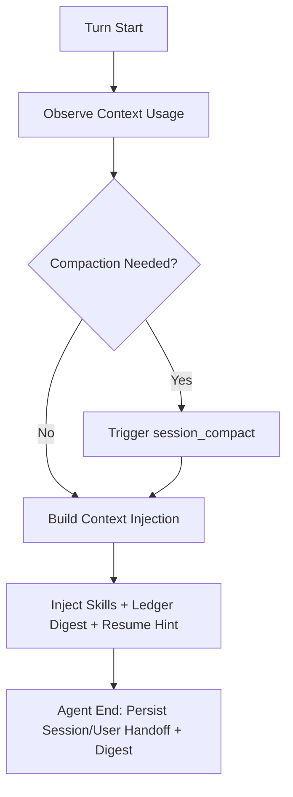

# Journey: Context And Memory

## Objective

Maintain high-signal context over long-running sessions and recover stateful continuity.

## Key Steps

1. Runtime observes context usage on each turn
2. Context budget decides compaction with turn/time cooldown and high-pressure bypass
3. Injection text is built from skills, ledger digest, resume hint, and quota-bounded structured handoff sections
4. Session handoff and recursive user-memory hierarchy are persisted at turn end
5. Handoff generation has circuit-breaker fallback to cached handoff/digest preview

## Code Pointers

- Context budget manager: `packages/roaster-runtime/src/context/budget.ts`
- Context transform hook: `packages/roaster-extensions/src/context-transform.ts`
- Memory hook: `packages/roaster-extensions/src/memory.ts`
