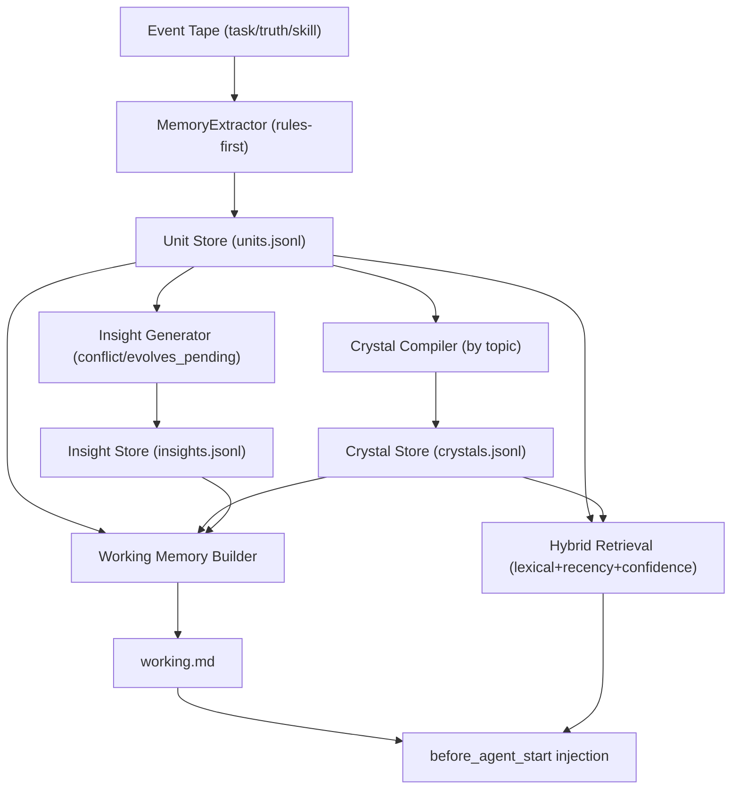

# Journey: Memory Projection And Recall

## Objective

Maintain a durable, high-signal memory layer that grows from the event tape and
projects memory context on each agent start:

- `brewva.memory-working`: `[WorkingMemory]` compact “what matters now” snapshot (`working.md`)
- `brewva.memory-recall`: `[MemoryRecall]` task-aware top-k recall block (units + crystals)

Scope note:

- This journey describes the extension-enabled runtime profile.
- In `--no-extensions`, ingest/projection still runs, but memory auto-injection
  (`brewva.memory-working` / `brewva.memory-recall`) and memory bridge hooks are intentionally not active.
- `--no-extensions` still injects a lightweight runtime-core autonomy/status block
  (`[CoreTapeStatus]`), which is separate from memory projection injection.

The system is intentionally **event-driven** and **projection-based**:

- Trace source: session event tape (`.orchestrator/events/<session>.jsonl`)
- Projections: JSONL stores under `.orchestrator/memory/`
- No background daemon and no graph/vector database

## Key Flows

### 1) Ingest: events → units

**Trigger:** every successful `runtime.events.record()` write.

**Behavior:**

- The extractor consumes only high-signal semantic events (task/truth/skill, plus
  verification signals) and produces a small set of unit candidates.
- Units are **deduplicated by fingerprint** and merged (append-only JSONL on disk,
  with periodic compaction).
- Each accepted upsert emits a `memory_unit_upserted` event.

Code pointers:

- Ingest hook: `packages/brewva-runtime/src/runtime.ts`
- Extractor: `packages/brewva-runtime/src/memory/extractor.ts`
- Unit store: `packages/brewva-runtime/src/memory/store.ts`

### 2) Refresh: units/crystals/insights → working.md

**Trigger:** `refreshIfNeeded()` called during `runtime.context.buildInjection()`, and also
on extension hooks (e.g. `agent_end`).

**Refresh conditions:**

- Daily refresh: publish once per local day after `dailyRefreshHourLocal`
- Dirty refresh: publish after key events add reason-tagged dirty entries

**Behavior:**

- Compile crystals per topic once units reach a minimum density (`crystalMinUnits`)
- Crystal `summary` is currently an extract of the highest-signal unit statements,
  not an abstractive/LLM-generated summary. This keeps the system deterministic
  and cheap, but increases redundancy; treat it as a future optimization lever.
- Generate insights (`conflict` and `evolves_pending`)
- Build a fixed-template working snapshot and publish `working.md`
- Emit `memory_working_published` and `memory_crystal_compiled` events

Code pointers:

- Engine: `packages/brewva-runtime/src/memory/engine.ts`
- Crystal compiler: `packages/brewva-runtime/src/memory/crystal.ts`
- Working memory builder: `packages/brewva-runtime/src/memory/working-memory.ts`

### 3) Inject: working + recall blocks into the agent context

**Trigger:** `before_agent_start` in extensions calls `runtime.context.buildInjection()`.

**Behavior:**

- Runtime registers two independent sources:
  - `brewva.memory-working` from `working.md` snapshot content
  - `brewva.memory-recall` from task-aware recall hits derived from `{task.goal + user prompt (+ open insight terms)}`
- Open insight terms emit `memory_recall_query_expanded` and are intentionally bounded to keep lexical recall stable.
- `memory.recallMode="fallback"` can skip `brewva.memory-recall` under high context pressure.
- Both sources respect global context budget policies (zone caps + truncation/drop decisions).

Code pointers:

- Context injection orchestration: `packages/brewva-runtime/src/runtime.ts`
- Context transform hook: `packages/brewva-extensions/src/context-transform.ts`
- Memory bridge hook (refresh on `agent_end`): `packages/brewva-extensions/src/memory-bridge.ts`

### 4) Retrieve: lightweight recall without embeddings

The retrieval pipeline is intentionally “Route A simple”:

- Candidate pool: units + crystals for the current session
- Scoring: lexical overlap + recency + confidence, with a small alias/stemming layer.
  Coefficients are configured via `memory.retrievalWeights.*` and normalized to
  sum to 1 during config loading.
- Superseded units are excluded from recall to prevent stale guidance

Code pointer:

- Retrieval scoring: `packages/brewva-runtime/src/memory/retrieval.ts`

### 5) EVOLVES (shadow): propose → review → apply

When `memory.evolvesMode="shadow"`, the engine proposes small “evolves” edges for
recent units within the same topic. Edges are stored in `evolves.jsonl` and are
reviewed explicitly via tool/runtime API.

**Propose:**

- Generate a limited set of candidate edges (newer → older) per topic
- Only create `evolves_pending` insights for actionable relations (`replaces` / `challenges`)
- Relation inference is heuristic and intentionally conservative in its impact:
  proposals are always manual-review gated. If you ever add an auto-accept mode,
  tighten `inferEvolvesRelation()` to avoid defaulting to `replaces` on weak signals.

**Review:**

- Tool: `memory_review_evolves_edge { edgeId, decision }`
- Emits `memory_evolves_edge_reviewed`

**Apply side-effects (on accept):**

- Auto-dismiss the matching `evolves_pending` insight
- If relation is `replaces` or `challenges`, mark the older unit as `superseded`
  (emits `memory_unit_superseded`)
- Auto-dismiss any open `conflict` insights that reference the superseded unit
- Mark dirty entries so the next refresh updates `working.md`

Code pointers:

- Edge proposals + review workflow: `packages/brewva-runtime/src/memory/engine.ts`
- Edge store: `packages/brewva-runtime/src/memory/store.ts`
- Tool surface: `packages/brewva-tools/src/task-ledger.ts`

## Operational Notes

### Storage layout (projection artifacts)

Memory artifacts live under `.orchestrator/memory/`:

- `units.jsonl`, `crystals.jsonl`, `insights.jsonl`, `evolves.jsonl`
- `working.md`
- `state.json` (publish timestamps + dirty entries)

See `docs/reference/artifacts-and-paths.md` for the canonical list.

### Invariants

- Trace is the tape: memory never mutates or backfills `.orchestrator/events/`.
- Projections are append-only JSONL with compaction: replay is “last row wins”.
- `working.md` is a projection output, not a source of truth.
- Projection events include snapshot payloads, enabling tape-driven rebuild when
  projection files are missing.
- `evolves.jsonl` is the local projection authority for evolves edges during
  normal operation (no duplicated edge state on units).
- Refresh publication uses an advisory lock file (`.refresh.lock`) to reduce
  concurrent-publish race windows in multi-session edge cases.

## Troubleshooting

### Working memory not injected

Checklist:

1. `memory.enabled` is `true` and config is loaded as expected.
2. Extensions are enabled and `before_agent_start` runs `runtime.context.buildInjection()`.
3. `.orchestrator/memory/working.md` exists and is non-empty.
4. Check tape for `context_injection_dropped` (budget hard-limit / budget exhausted).
5. If running with `--no-extensions`, this checklist does not apply for
   `brewva.memory-working` / `brewva.memory-recall` because those extension hooks are disabled.

### Working memory looks stale after major changes

Checklist:

1. Confirm new events were recorded (tape contains `task_event` / `truth_event` / `skill_completed`).
2. Confirm memory extracted units (`memory_unit_upserted` events).
3. Confirm dirty entries are cleared on publish (`state.json` `dirtyEntries` should be empty after refresh).
4. If an evolves edge was accepted, ensure the older unit is `superseded` and no longer appears in:
   - `[WorkingMemory]` Decisions section
   - `[MemoryRecall]` hits

### Memory projection files were removed

Checklist:

1. Start a new turn (`onTurnStart`) for the same session id.
2. Confirm tape contains historical `memory_*` events for the session.
3. Check `.orchestrator/memory/*.jsonl` and `working.md` are recreated.
4. If no `memory_*` snapshots exist (older tapes), semantic replay still rebuilds
   core units from task/truth/skill events.

### EVOLVES pending keeps reappearing

Checklist:

1. Ensure your review call targets the correct `edgeId` shown in the insight.
2. Verify `memory_evolves_edge_reviewed` was recorded.
3. Verify the matching `evolves_pending` insight row transitioned to `dismissed`.

## Code Pointers (index)

- Engine: `packages/brewva-runtime/src/memory/engine.ts`
- Types: `packages/brewva-runtime/src/memory/types.ts`
- Store: `packages/brewva-runtime/src/memory/store.ts`
- Extractor: `packages/brewva-runtime/src/memory/extractor.ts`
- Crystal compiler: `packages/brewva-runtime/src/memory/crystal.ts`
- Working memory builder: `packages/brewva-runtime/src/memory/working-memory.ts`
- Retrieval: `packages/brewva-runtime/src/memory/retrieval.ts`
- Extension wiring: `packages/brewva-extensions/src/index.ts`
