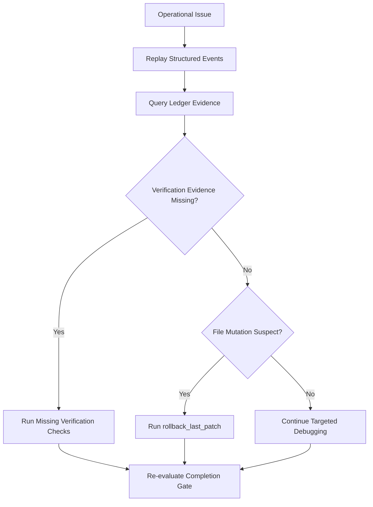

# Journey: Operations And Debugging

## Objective

Provide deterministic diagnostics for blocked sessions, failed verification, and regressions.

## Key Steps

1. Replay recent session events
2. Inspect tool-level ledger evidence
3. Patch missing verification evidence
4. Roll back latest tracked mutation when needed
5. Re-run and confirm gate status

## Code Pointers

- Replay and undo flow: `packages/roaster-cli/src/index.ts`
- Ledger query tool: `packages/roaster-tools/src/ledger-query.ts`
- Rollback tool: `packages/roaster-tools/src/rollback-last-patch.ts`
