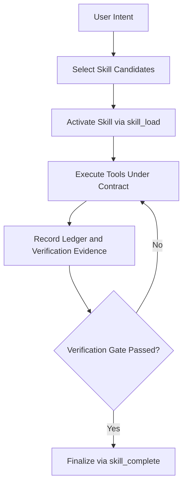

# Journey: Planning To Execution

## Objective

Move from intent to verifiable completion with explicit skill contracts.

## Key Steps

1. Select and activate a skill (`skill_load`)
2. Execute tool calls under contract constraints
3. Collect evidence and satisfy verification requirements
4. Complete the active skill with required outputs

## Code Pointers

- Skill activation: `packages/roaster-runtime/src/runtime.ts`
- Load tool: `packages/roaster-tools/src/skill-load.ts`
- Completion + verification: `packages/roaster-tools/src/skill-complete.ts`
