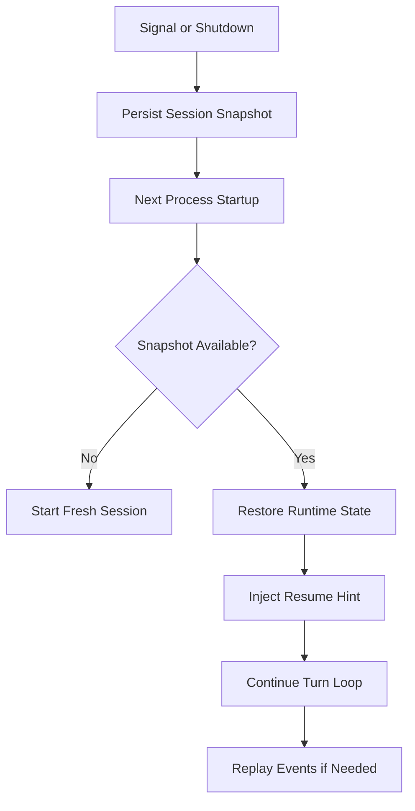

# Journey: Session Handoff And Reference

## Objective

Recover interrupted sessions with explicit state restoration and replayability.

## Key Steps

1. Persist snapshot on interruption or shutdown
2. Restore active skill, counters, and verification state on startup
3. Build handoff sections (`decisions`, `artifacts`, `antiPatterns`) from recent evidence with goal-relevance ranking
4. Aggregate handoff into hierarchical user memory (`L0` recent, `L1+` recursive summaries)
5. Inject resume hints, latest handoff, and goal-filtered hierarchy layers with source/token quotas
6. Use circuit-breaker fallback when handoff generation is unstable
7. Continue execution and replay events for audit/debugging

## Code Pointers

- Snapshot store: `packages/roaster-runtime/src/state/snapshot-store.ts`
- Restore/persist APIs: `packages/roaster-runtime/src/runtime.ts`
- Signal handling: `packages/roaster-cli/src/index.ts`
- Memory extension: `packages/roaster-extensions/src/memory.ts`
