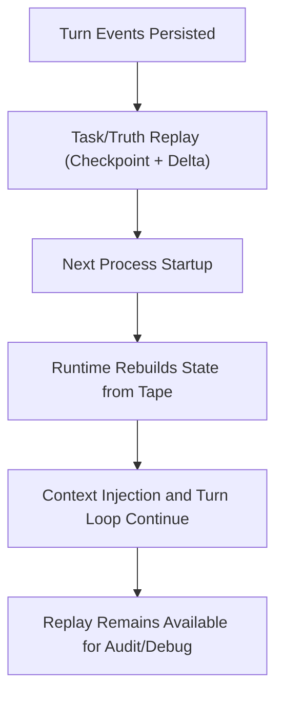

# Journey: Session Handoff And Reference

## Objective

Recover and continue sessions from persisted event tape, without runtime-level
session snapshot blobs.

## Key Steps

1. Persist task/truth/cost/tool events as the primary continuity source.
2. Replay foldable state from event tape using checkpoint + delta.
3. Continue execution and keep replay output fully derivable from persisted events.

## Code Pointers

- Runtime fold + injection flow: `packages/brewva-runtime/src/runtime.ts`
- Replay engine: `packages/brewva-runtime/src/tape/replay-engine.ts`
- Signal handling: `packages/brewva-cli/src/index.ts`
